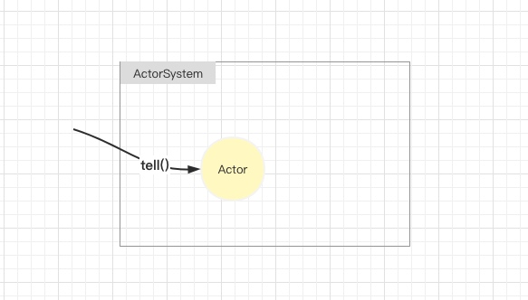

# 2. Actor基础：创建Actor并发送消息

---
layout:     post
title:      "2. Actor基础：创建Actor并发送消息"
subtitle:   "在ActorSystem中创建最简单的actor"
date:       2021-09-10 11:00:00
author:     "mujiang"
header-img: "img/about-bg-walle.jpg"
catalog: false
tags:
     - 技术
   
---

> “上面我们启动了ActorSystem，但是什么都没有，现在我们在里面创建一个actor，并给它发送消息。”

<p id = "build"></p>
---

[TOC]
  
在上一篇的例子里，我们启动ActorSystem后什么也没干，现在改造RootBehavior.create()的逻辑，在里面创建actor。




actor需要定义与创建：

* **定义**：actor的定义通过一个actor类来定义，在其中编写它对消息的处理逻辑
* **创建**：或者叫实例化，通过akka的context加载到ActorSystem中。

如下所示：

```java
    public static class RootBehavior {
        static Behavior<Void> create() {
            return Behaviors.setup(context -> {
                        // 创建一个actor，并给它发送消息
                        ActorRef<String> hello = context.spawn(HelloWorldActor.create(), "HelloWorld");
                        hello.tell("hi");
                        
                        return Behaviors.empty();
                    }
            );
        }
    }
``` 

## 创建actor

创建/实例化一个actor是下面这句：

```java
ActorRef<String> hello = context.spawn(HelloWorldActor.create(), "HelloWorld");
```

其中:

* `context.spawn()`：需要2个参数，第一个是定义actor的类，第二个是这个actor的名称。

* `ActorRef<String> hello`：是这个actor的引用，只有通过这个引用，才可以和这个actor交互。可以理解为actor引用是指向这个actor的地址。（**注**：由于Actor不同于面向对象思想，因此actor不是某个对象，需要通过引用获取。这带来的一个好处是，即使actor发生了重启，通过这个ActorRef依旧可以调用这个actor）

<!--todo: actor挂了使用引用会发生什么-->


## 定义actor


下面主要看下actor类的定义，即`HelloWorldActor`：


```java
public class HelloWorldActor extends AbstractBehavior<String> {

    //常规操作：私有化构造方法
    private HelloWorldActor(ActorContext<String> context) {
        super(context);
    }

    //常规操作：通过create()静态方法返回经过封装的Behavior
    public static Behavior<String> create() {
//        return Behaviors.setup(HelloWorldActor::new);
        return Behaviors.setup(context -> new HelloWorldActor(context));
    }

    @Override
    public Receive<String> createReceive() {
        return newReceiveBuilder()
                .onMessage(String.class, this::onMsg)
                .build();
    }
    //收到消息后，会进入此方法，即在此方法中实现处理消息的逻辑
    private Behavior<String> onMsg(String msg) {
        log.info("****** hello world actor"+ " 收到消息：{} \t", msg);
        return this;
    }

}
```
这里面有几个需要关注的点：

1. actor类需要继承自Behavior，通常继承官方封装过的AbstractBehavior。
2. 私有化actor类的构造方法，通过`create()`静态方法提供经过`Behaviors.setup()`封装过的实例。（官方写法，可能是因为akka不希望在别的地方创建和使用actor类的对象）
3. 重写`createReceive()`方法，在里面指定收到消息后需要调用的方法，即`onMsg()`，并实现`onMsg()`
4. 注意：在onMsg()方法中，记得return this，只有这样，才能保证这个actor能执行和之前相同的逻辑。如果return Behaviors.empty()或者其他的Behavior，将改变此actor的行为，这在后面停止actor时会用到。


这样，我们就实现了actor的定义和创建，并能给这个actor发消息。