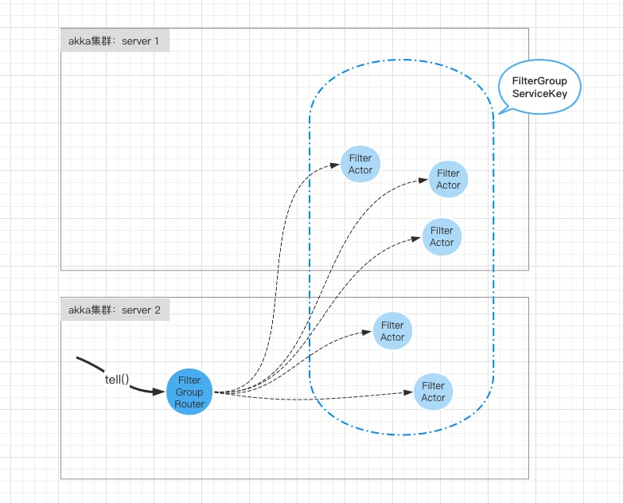

# 6. 集群 

--- 
layout:     post
title:      "6. 集群"
subtitle:   "集群的搭建以及集群间发送消息"
date:       2021-09-10 11:00:00
author:     "mujiang"
header-img: "img/about-bg-walle.jpg"
catalog: false
tags:
     - 技术
   
---

> “在前面，我们实现了单机版的`AkkaSystem`，也实现了actor的并行计算。现在我们做成分布式的/集群化的`AkkaSystem`。以实现最终的目标。”

<p id = "build"></p>
---

[TOC]

## 相关概念

在实现集群前，先介绍几个概念。


* `node`：集群的成员，分布式系统中的节点
* `seed nodes`：种子节点（列表），从命名可以看出，是集群产生的源头，但不是集群的全部，也就是说我们不需要把集群全部节点的地址放入种子节点列表。并且，在运行过程中，种子列表的配置对集群没有任何影响。


## 集群搭建

从单节点改造成集群，主要通过修改配置文件完成，配置文件的修改可以分以下几部分：

1. `akka.actor.provider` 从local修改为cluster
2. 添加`akka.cluster.seed-nodes`的配置
3. 如果是自定义的消息类型，需要配置消息对象的序列化方式，即添加`akka.actor.serializers`等相关配置。（akka不建议使用java本身的序列化方式，认为太低效了，并支持Jackson、Protobuf等方式）

以下是最基础版的配置文件示例：


```js
akka {
    jvm-exit-on-fatal-error = off
    loglevel = "INFO"
    loggers = ["akka.event.slf4j.Slf4jLogger"]

    actor {
        provider = "cluster"
        serializers {
            jackson-json = "akka.serialization.jackson.JacksonJsonSerializer"
        }
        serialization-bindings {
            "com.example.akka.message.DevicePropertyMessage" = jackson-json
        }
    }
    remote.artery {
        canonical {
            hostname = "127.0.0.1"
            port = 5001
        }
    }
    cluster {
        seed-nodes = [
            "akka://cluster-example@127.0.0.1:5001",
            "akka://cluster-example@127.0.0.1:5002"
            ]
    }
}
```


在代码中，`AkkaSystem`的启动方式和之前的一样，不需要做任何修改。


## 集群间通信

现在集群搭起来了，那集群间的actor该如何互相发送消息呢？

一种方式是分布式的Pub Sub，这有些像kafka的发布订阅模式，但这需要使用一个特殊的actor来实现。因此不是我们想达到的目的。

在路由里提到，group router是可以跨节点的。那我们就通过group router来实现集群间的通信。如下图所示：




在**server节点1**里，创建3个actor并注册到名为FilterGroupRouterKey的`ServiceKey`上，

```java
// actor的配置
BehaviorConfig filterConfig = new BehaviorConfig("power > 2000");
// 创建filter behavior
Behavior<IDeviceMessage> filterBehavior = FilterActor.create(filterConfig, null);

// 注册到filter Pool Router 到某个key
ServiceKey<IDeviceMessage> filterServiceKey = ServiceKey.create(IDeviceMessage.class, "FilterGroupRouterKey");
for(int i = 1; i <= 3; i++){
    ActorRef<IDeviceMessage> filterActorRef = context.spawn(filterBehavior, "FilterActor" + i);
    context.getSystem().receptionist().tell(Receptionist.register(filterServiceKey, filterActorRef.narrow()));
}
```

在**server节点2**里，创建2个actor，也注册到名为FilterGroupRouterKey的`ServiceKey`上，并在2上面获得group router并发送10条消息：


```java
// actor的配置
BehaviorConfig filterConfig = new BehaviorConfig("power > 2000");
// 创建filter behavior
Behavior<IDeviceMessage> filterBehavior = FilterActor.create(filterConfig, null);

// 注册到filter Pool Router 到某个key
ServiceKey<IDeviceMessage> filterServiceKey = ServiceKey.create(IDeviceMessage.class, "FilterGroupRouterKey");
for(int i = 4; i <= 5; i++){
    ActorRef<IDeviceMessage> filterActorRef = context.spawn(filterBehavior, "FilterActor" + i);
    context.getSystem().receptionist().tell(Receptionist.register(filterServiceKey, filterActorRef.narrow()));
}

DevicePropertyMessage message = DevicePropertyMessage.builder()
        .thingId("D007")
        .current(3.58)
        .voltage(380.00)
        .build();
Behavior<IDeviceMessage> filterGroupBehavior = Routers.group(filterServiceKey).withRoundRobinRouting();
ActorRef<IDeviceMessage> filterGroupRouterRef = context.spawn(filterGroupBehavior, "FilterGroupRouter");

 Thread.sleep(5 * 1000);
// 给 router发送消息
for (int i = 0; i < 10; i++) {
    filterGroupRouterRef.tell(message);
}
return Behaviors.empty();
```

从结果可以看出，有6条消息发送到了有3个actor的节点1，4条消息发到了有2个actor的节点2。这也验证了group router的跨节点路由的能力。

在日志中，我们可以看到group router下的更新过程：


```log
Update from receptionist: [Listing(ServiceKey[com.example.akka.message.IDeviceMessage](FilterGroupRouterKey),Set(Actor[akka://cluster-example@127.0.0.1:5001/user/FilterActor1#1528585186], Actor[akka://cluster-example@127.0.0.1:5001/user/FilterActor2#-1458209494] …… ,true)]
```

可以看到，远程的actor注册以后，path（`akka://cluster-example@127.0.0.1:5001/user/FilterActor1#1528585186`）里是带着IP和端口的，这也是group router能实现集群内路由的原因。

但是，非常重要的一点是，也是**很bug**的一点，group router是基于`receptionist`的机制来实现的，即接待员列表会在集群内同步，因此这个同步是有时间的。所以当group router刚创建/启动的时候，routee列表是空的，这时候如果给group router发消息，消息会被抛掉。

```log
Message [DevicePropertyMessage] to Actor[akka://cluster-example/user/FilterGroupRouter#-2139769357] was dropped. No routees in group router for [ServiceKey[IDeviceMessage](FilterGroupRouterKey)]. [1] dead letters encountered.
```


