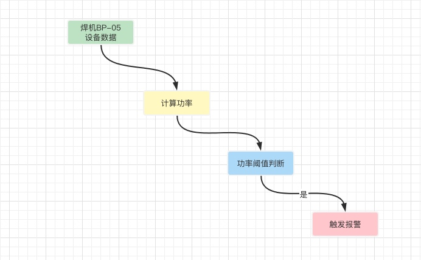
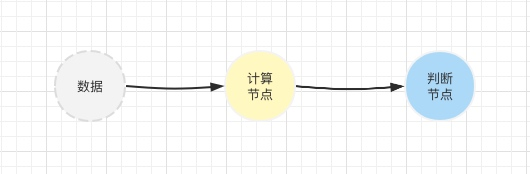

# 0.概述/前言

> “本节类似图书里的前言，旨在说明这一系列文章的写作目的、目标读者等内容。”

---

[TOC]

## 写作目的

本系列写作的最主要目的是用输出倒逼输入，协助自己理清思路，分享是其次的。

由于最近的项目里使用到了akka框架，整个过程处于摸索阶段，遇到了不少雷和坑，排雷填坑的过程，阅读了官方文档，也在网上找过资料。发现了一些问题：

* 网上的资料：文章理论太多，并且大部分是来自官方文档的搬运，并且很多文章太旧了，是基于classic版本，而akka最新的typed版本在理念和用法上已经是完全不同的了。

* 官方文档：官方文档是手册，不是教程。它是碎片的，是按一个个模块的组织的，适合查阅但不适合阅读。因此对于新手可能很难入门。

于是便想写一个教程，整理自己的思路的同时，希望能帮助新手入门akka。因此，本系列面向的读者是刚刚接触akka，并想试一试的朋友。

`注`：
* 本系列文章并不会介绍akka的全部内容。只会介绍个人来自项目的实践。如果需要扩展，建议阅读官方文档。
* 如果文中有不正确或不认同的地方，欢迎指出和讨论，大家一起进步。

## 目标场景

我们项目的一个功能是通过akka实现一个动态的规则引擎。通过动态配置规则链，对物联网接入的设备数据进行各种各样的处理。最经典的场景就是，设备上报了电流和电压值，先计算出功率，然后对功率进行判断，如果超过阈值，就触发报警。如下图所示，

本系列的文章将一步步地实现最简单的原型场景，只有2个节点：计算节点和判断节点。

### 路线图/步骤：

1. 启动ActorSystem
2. 创建Actor，并发送消息
3. 扩展Actor，带初始化参数并自定义消息类型
4. 启停Actor
5. 路由，把actor分身
6. 集群化
7. 工程化
8. 其他：集群下的单实例

## 背景信息

### 基于版本

示例代码基于com.typesafe.akka版本：2.6.14

### 参考资料

* **官方文档**： https://doc.akka.io/docs/akka/current/typed/guide/introduction.html

* **图书**：
    - 1. 《Akka入门与实践》，人民邮电出版社，2017：java与Scala双语言，太过简洁，而且是基于旧版akka classic参考价值不大。
    - 2. 《Akka实战：快速构建高可用分布式应用》，机械工业出版社，2018：java语言，很好的入门，但是是基于旧版akka classic。
    - 3. 《Akka实战》，机械工业出版社，2019：Scala语言，基于旧版akka classic。

## 发布地址

本系列文章，将会发布在各个地方。

* **示例代码**：https://github.com/littlemujiang/akka-typed-example.git

* **notion**：
* **个人blog**：
* **CSDN**：

