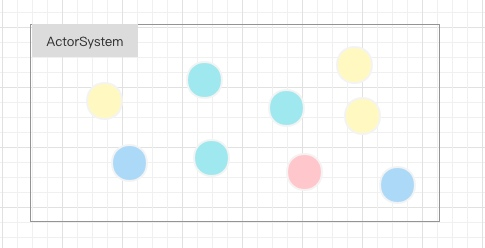

# 1. 基础概念与启动ActorSystem

---
layout:     post
title:      "1. 基础概念与启动ActorSystem"
subtitle:   "把ActorSystem启动起来"
date:       2021-09-10 11:00:00
author:     "mujiang"
header-img: "img/about-bg-walle.jpg"
catalog: false
tags:
     - 技术
   
---

> “akka的理论基础，以及基本环境的搭建与启动”

<p id = "build"></p>
---

[TOC]


## 基础概念

### 简介

akka系统是**Actor模型**的实现。

**Actor模型**被提出的初衷是解决并行处理的问题。在传统的面向对象模型下，完成一套复杂的逻辑/功能，我们需要创建一些对象，每个对象包含一些方法，然后方法之间调来调去。在这个框架下，通常通过多线程来实现并行计算，这就涉及了线程阻塞的问题，以及资源冲突和锁的问题，让代码的设计和编写变得复杂。

那Actor是怎么解决阻塞和锁的问题呢？

Actor模型把一套复杂功能拆分成不同的actor，不同的actor能完成不同的逻辑，actor之间通过传递消息来进行交互，这不同于方法的调用，actor在发出消息后不需要等待返回，因此actor在发送消息后可以马上继续执行，这就避免了阻塞。此外，一个actor同时最多只能处理1条消息，并且消息是不可变的，于是也就不再需要锁了。（这里的前提是消息不可变，即immutable message）

因此，在使用Actor模型设计系统时，可以把系统的功能按流程进行拆分，拆分到一堆各种各样的actor。


### 概念

* `ActorSystem`：akka系统，可以想象成一个容器，里面运行了很多actor。

* `Actor`：可以想象成一个人，这个人有各种能力，可以执行一种或多种计算/处理逻辑，actor之间可以传递消息，就像人与人直接可以对话。

* `Behavior`：Actor拥有的每项能力，可以认为是一种Behavior。


## 启动ActorSystem

如上面所说，actor的运行需要一个容器，即ActorSystem。所以我们第一步先来把这个容器启动起来。




akka的启动很简单，也比较规范。如下所示：


```java
    public static void main(String[] args) {
        //指定akka系统启动的端口
        String port = "5001";
        //加载local.conf的配置文件，并替换"akka.remote.artery.canonical.port"这个参数
        Map<String, Object> overrides = new HashMap<>();
        overrides.put("akka.remote.artery.canonical.port", port);
        Config config = ConfigFactory.parseMap(overrides)
                .withFallback(ConfigFactory.load("local"));
        //启动akka系统，启动时指定一个behavior，并给系统命名
        ActorSystem<Void> system = ActorSystem.create(RootBehavior.create(), "local-example", config);
        log.info("=== actor system started ===");

    }
```

**其中**：

`RootBehavior`是启动用的actor，可以在里面执行一些初始化的任务。

```java
    public static class RootBehavior {
        static Behavior<Void> create() {
            return Behaviors.setup(context ->
                    Behaviors.empty()
            );
        }
    }
``` 

`local.conf`是配置文件，


```js
akka {
    loggers = ["akka.event.slf4j.Slf4jLogger"]
    loglevel = "INFO"
#    stdout-loglevel = "DEBUG"
#    logging-filter = "akka.event.slf4j.Slf4jLoggingFilter"

    actor {
             provider = "local"
    }
    remote.artery {
        canonical {
            hostname = "127.0.0.1"
            port = 5001
        }
    }
}
```


以上是最基础的形态，主要需要配置启动的端口、指定akka系统的名称。这样就启动了一个akka系统。


## 停止ActorSystem

// todo: 

暂时先会点按钮停止就行了。

