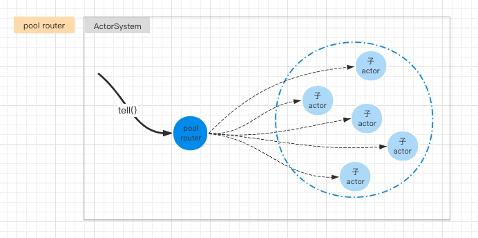
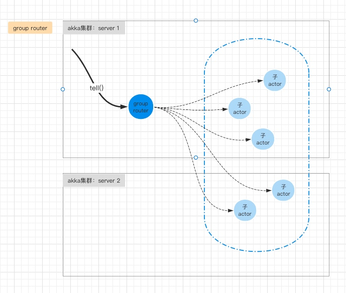

# 5.路由

> “之前的例子中我们创建和使用的都是单个actor，而一个actor同时只能处理一条消息，这并没有发挥出akka并行计算的优势，我们希望能并行地去处理消息，就像kafka的consumer那样。这就需要使用到akka中的路由了。”

<p id = "build"></p>
---

[TOC]

路由，和常规理解的一样，当消息到达后，可以按一定的策略，把消息分给路由之后的actor处理。在akka中有2类路由，pool路由和group路由。

* **pool路由**：从名字看，一堆actor都在一个池子里。
* **group路由**：从名字看，一堆actor都属于一个组。

那2个有什么区别呢？

在非集群环境下或者单节点环境下，两者没有什么区别，都能完成消息的负载/分发。**但是：**pool路由只能在单个ActorSystem内进行路由，而group路由可以在集群内跨ActorSystem进行路由。（可以理解为，pool是像池子一样有物理边界的，而group则像群组一样可以跨地域）如下图所示。

* pool router:



* group router:




并且，2个路由的实现方式也不同。

## pool router

创建pool路由的方式如下：

```java
    // actor的配置
    BehaviorConfig filterConfig = new BehaviorConfig("power > 2000");
    // 创建filter behavior
    Behavior<IDeviceMessage> filterBehavior = FilterActor.create(filterConfig, null);
    // 封装filter behavior 成 pool router behavior
    Behavior<IDeviceMessage> filterPoolBehavior = Routers.pool(5, filterBehavior.narrow()).withRoundRobinRouting();
    // 实例化filter pool router
    ActorRef<IDeviceMessage> filterPoolRouterRef = context.spawn(filterPoolBehavior, "FilterPoolRouter");

    DevicePropertyMessage message = DevicePropertyMessage.builder()
            .thingId("D007")
            .current(3.58)
            .voltage(380.00)
            .build();
    // 给pool router发送消息
    for (int i = 0; i < 10; i++) {
        filterPoolRouterRef.tell(message);
    }
```

主要有3个步骤：

1. 先创建池子内基础actor的Behavior，这里我们为FilterActor创建其pool actor。
2. 把基础actor的Behavior通过`Routers.pool()`方法封装成pool actor的Behavior。这里可以配置每个pool路由下子actor的数量，以及路由策略（支持轮询、随机、广播、一致性哈希这几个机制）。
3. 通过`spawn()`方法实例化pool actor。

这样当我们把消息发送给pool路由时，pool路由会按这里配置的RoundRobin策略，向内部的5个子actor，轮询发送消息。

在上面的例子中，我们给pool router发送10条消息，这个pool下面有5个子actor。当`FilterActor`收到消息后，我们依次打印出，当前actor的actor path，线程id，objectId。结果如下：


```log
=== actor system started ===
[filter actor] 收到消息： actor path=akka://local-example/user/FilterPoolRouter/$b 	 threadId=28 	 objectId=1644765223
[filter actor] 收到消息： actor path=akka://local-example/user/FilterPoolRouter/$c 	 threadId=29 	 objectId=710798201
[filter actor] 收到消息： actor path=akka://local-example/user/FilterPoolRouter/$e 	 threadId=31 	 objectId=1877431981
[filter actor] 收到消息： actor path=akka://local-example/user/FilterPoolRouter/$d 	 threadId=30 	 objectId=1124465799
[filter actor] 收到消息： actor path=akka://local-example/user/FilterPoolRouter/$a 	 threadId=23 	 objectId=610546090
[filter actor] 收到消息： actor path=akka://local-example/user/FilterPoolRouter/$c 	 threadId=29 	 objectId=710798201
[filter actor] 收到消息： actor path=akka://local-example/user/FilterPoolRouter/$e 	 threadId=31 	 objectId=1877431981
[filter actor] 收到消息： actor path=akka://local-example/user/FilterPoolRouter/$b 	 threadId=28 	 objectId=1644765223
[filter actor] 收到消息： actor path=akka://local-example/user/FilterPoolRouter/$d 	 threadId=30 	 objectId=1124465799
[filter actor] 收到消息： actor path=akka://local-example/user/FilterPoolRouter/$a 	 threadId=23 	 objectId=610546090
```

可以发现以下几点：

* 子actor会以FilterPoolRouter/$a、 FilterPoolRouter/$b的方式命名，其中`FilterPoolRouter`是pool actor的名字，可以看出每个子actor是在pool actor的下一个层级的。
* 消息会被不同的线程和actor类处理（这里涉及akka的消息dispatcher机制，有兴趣的可以看官方文档的Dispatchers一节）


## group router

创建group路由的方式如下：


```java
    // actor的配置
    BehaviorConfig filterConfig = new BehaviorConfig("power > 2000");
    // 创建filter behavior
    Behavior<IDeviceMessage> filterBehavior = FilterActor.create(filterConfig, null);
    // 实例化filter actor
    ActorRef<IDeviceMessage> filterActorRef = context.spawn(filterBehavior, "FilterActor");
    
    // 注册到filter Pool Router 到某个key
    ServiceKey<IDeviceMessage> filterServiceKey = ServiceKey.create(IDeviceMessage.class, "FilterGroupRouterKey");
    context.getSystem().receptionist().tell(Receptionist.register(filterServiceKey, filterActorRef.narrow()));
```
主要有3个步骤：

1. 实例化一个普通的actor，并获得其ActorRef
2. 给组路由创建一个`ServiceKey`，这个key就是group router的唯一标识
3. 通过`receptionist().tell()`把上面的actor注册到key上


这样我们就把一个actor注册到了组路由上面了，那我该如何给这个组发消息呢？


```java
 //创建名称相同的key
 ServiceKey<IDeviceMessage> filterServiceKey = ServiceKey.create(IDeviceMessage.class, "FilterGroupRouterKey");
 //获取group route的ActorRef
 Behavior<IDeviceMessage> filterGroupBehavior = Routers.group(filterServiceKey).withRoundRobinRouting();
 ActorRef<IDeviceMessage> filterGroupRouterRef = context.spawn(filterGroupBehavior, "FilterGroupRouter");
 // 给group router发送消息
 filterGroupRouterRef.tell(message);
```

也可以分为3步：
1. 首先创建一个名称相同的`ServiceKey`，或者直接使用已创建的`ServiceKey`
2. 通过`Routers.group()`方法获取到group router的Behavior，同时可以指定路由策略
3. 使用`context.spawn()`创建group router的actor，这样就获得了group router的ActorRef，也就可以发送消息了。

同样的，我们注册5个actor到group router上，然后给group router发送10条消息，来看下actor path，线程id，objectId。结果如下：


```log
[filter actor] 收到消息： actor path=akka://local-example/user/FilterActor3 	 threadId=29 	 objectId=868900288
[filter actor] 收到消息： actor path=akka://local-example/user/FilterActor2 	 threadId=28 	 objectId=1697801780
[filter actor] 收到消息： actor path=akka://local-example/user/FilterActor4 	 threadId=30 	 objectId=1650033925
[filter actor] 收到消息： actor path=akka://local-example/user/FilterActor1 	 threadId=23 	 objectId=1977819714
[filter actor] 收到消息： actor path=akka://local-example/user/FilterActor5 	 threadId=31 	 objectId=403997215
[filter actor] 收到消息： actor path=akka://local-example/user/FilterActor3 	 threadId=29 	 objectId=868900288
[filter actor] 收到消息： actor path=akka://local-example/user/FilterActor4 	 threadId=30 	 objectId=1650033925
[filter actor] 收到消息： actor path=akka://local-example/user/FilterActor2 	 threadId=28 	 objectId=1697801780
[filter actor] 收到消息： actor path=akka://local-example/user/FilterActor1 	 threadId=23 	 objectId=1977819714
[filter actor] 收到消息： actor path=akka://local-example/user/FilterActor5 	 threadId=31 	 objectId=403997215
```

可以发现:

* 消息仍然被均匀地分发到了5个actor上，由不同的类和线程处理
* 值得注意的是actor的actor path，与pool actor不同，每个actor并不在group actor的层级之下，也就是说他们并不是group actor的子actor。


在这里，我们可以学习actor的层级逻辑了，如下图所示，在ActorSystem中，每个actor是分层级的，而且这个层级体现在actor path中。我们通过`spawn()`方法创建的actor，都会在user下，子actor会受父actor管理。

**注：**在typed版本下，actor path的用途其实并不太大，在classic版本中，我们可以通过actor path获取到ActorRef。


总结来说，pool router的逻辑是管理模式，告诉它你要路由的行为（即Behavior）、路由规则和子actor数量，它会自己创建一堆子actor，来实现消息的分发。而group router的逻辑是注册模式，给router起一个key，然后把actor注册到这个key上，然后通过查注册表来实现消息的分发。**除此之外，非常重要的一个差别是，pool router只能在当前ActorSystem下进行，而group router可以跨ActorSystem，在集群内实现路由**，后面实现集群的时候，会再进一步介绍。