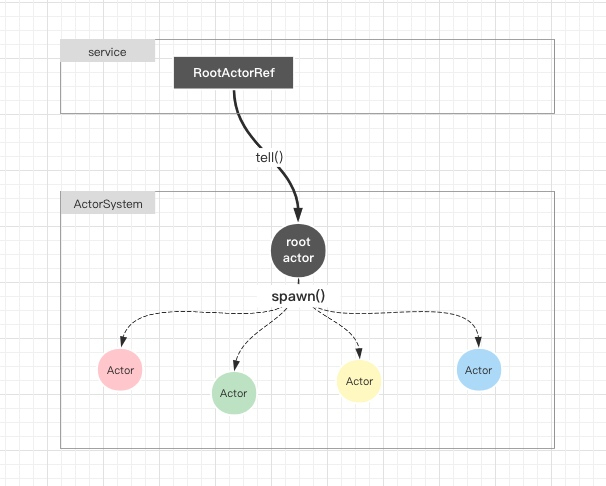

# 7.工程化

> “工程化的一项主要目标就是通过暴露REST API来管理ActorSystem内的actor。”

---

[TOC]

由于我们的服务通常是基于spring boot开发，打成jar包运行在服务器上。因此主要需要解决如何和spring boot整合的问题。

在实践过程中，我们发现，创建actor（调用context.spawn()方法）是需要`ActorContext`信息的，而**这个`ActorContext`是不能被拿到akka环境外使用的**。也就是说，不能从service里面直接去调用context.spawn()来创建actor。

其实，使用akka会迫使我们转变思路，也就是不能用常规思路去设计。在akka中，一切行为都是由消息触发的。

因此我们最后的方案是，在ActorSystem启动时，生成一个用来创建actor的root actor。我们把这个root actor的ActorRef放到系统的公共变量里，然后通过给这个actor发消息来实现对ActorSystem内actor的管理。示意图如下：

