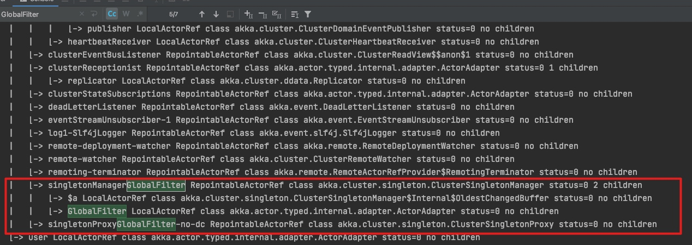

# 其他：集群下的单例actor


> “分布式集群保障了服务的高可用，但同时要求actor必须是无状态的，对于有状态的情况，可以把状态放入数据库，但这增加了额外的开销。也可以使用akka提供的单例actor。”

<p id = "build"></p>
---

[TOC]

单例actor，如名字所表示的，是整个集群下的单例。即整个集群只有这1个actor。

下面看下怎么创建和使用单实例的actor:


### 初始化单例actor


```java
ClusterSingleton singleton = ClusterSingleton.get(context.getSystem());
// 创建filter的behavior
Behavior<IDeviceMessage> filterBehavior = FilterActor.create(filterConfig, null);
// 创建单例actor
SingletonActor<IDeviceMessage> filterSingletonActor = SingletonActor.of(filterBehavior, "GlobalFilter");
ActorRef globalFilter = singleton.init(filterSingletonActor);
```

如上所示，需要先通过`SingletonActor.of()`方法创建一个特殊的Actor：`SingletonActor`，然后再通过
`ClusterSingleton.init()`方法初始化单例actor。

**注：** 其中`GlobalFilter`是此单例actor的名称，也是整个集群中的唯一标识，可以在集群中通过此name获得单例actor的ActorRef。

### 使用单例actor

我们可以通过创建时actor的name，在集群中获得单例actor的ActorRef。如下所示：

```java
ClusterSingleton singleton = ClusterSingleton.get(getContext().getSystem());
// 创建filter的behavior
BehaviorConfig filterConfig = new BehaviorConfig("power > 1000");
Behavior<IDeviceMessage> filterBehavior = FilterActor.create(filterConfig, null);
// 获得单例actor的ActorRef
SingletonActor<IDeviceMessage> filterActor = SingletonActor.of(filterBehavior, "GlobalFilter");
ActorRef<IDeviceMessage> globalFilterRef = singleton.init(filterActor);
// 给单例actor发消息
globalFilterRef.tell(message);
```

如上所示，可以发现，获取单例actor的引用的过程和初始化的时候是一样的。看下源码注释就会发现：这个方法其实是有则返回，没有则创建的实现思路。


### 单例actor的坑

单例actor主要有2个坑：

* 单例actor的默认地址是seed-nodes里的第一个地址。

也就说，如果seed-nodes里配置了2个server，如下面所示。但只启动127.0.0.1:5002这个server，并在5002上初始化单例actor，并给这个单实例发消息，是不能发送成功的。因为单例actor会默认找127.0.0.1:5001这个地址。

```js    
cluster {
    seed-nodes = [
        "akka://cluster-example@127.0.0.1:5001",
        "akka://cluster-example@127.0.0.1:5002"
        ]
}
```

* 单例actor，一旦初始化，便不能修改

也就是说，第一次初始化单例actor时，传了一个参数进去，后面是没办法再修改这个参数内容的。（至少我目前没有找到方法）

通过`ActorSystem.printTree()`方法打印下ActorSystem结构可以看到以下结果：



可以看出，我们创建的单例actor `GlobalFilter`是跟另外2个actor有关系的，分别是`singletonManagerGlobalFilter`和`singletonProxyGlobalFilter`，并且`singletonManagerGlobalFilter`是单例actor的parent actor。再结合`ClusterSingleton.init()`方法的源码注释看：


结合官方文档，manager是管理单例actor实例的，而proxy是指向单例actor的ref，因此如果manager存在，则不会再启动Actor实例，如果proxy存在，则直接返回。

可以这么理解，manager代理了单例actor，我们停止单例actor时，其实只是修改manager上的状态。因此，即使我们先stop单例atcor，再调用`ClusterSingleton.init()`创建新的单例actor，由于manager仍然存在，新的单例actor并不会被实例化，仍然用的旧的单例actor。如果需要重新创建单例actor，则必须停掉manager，而manage的ActorRef是没办法获取到的（其实是在typed版本下做不到，其实可以通过获得manager的path，再使用path，使用classic里的ActorSelector获取到，但这并不是理想的方案）。

