# 给媳妇讲区块链

> “区块链的原理和机制”

---

[TOC]

## 写作背景

前一阵子读了《跨越不可能》这本书，里面提到了5本书入门一个领域的方法。之前虽说知道区块链，但一直停留在道听途说的层面，只有点粗浅的认识，于是想用这个方法实践下，看看区块链到底是怎么回事。

在学习的过程中，采用了费曼学习法，用输出倒逼输入，一些似懂非懂的问题便浮现了出来。因此整理文字时发现，使用章节式的结构会产生思维跳跃，也许用问答的形式来输出更为合适些。

题目中的给媳妇讲，只是一种比喻，表示适合给没有太多计算机基础的人看。

**参考书籍**：

* 《图说区块链》
* 《区块链通识课50讲》
* 《区块链原理、技术及应用》
* 《区块链原理、架构及应用》
* 《区块链基础知识25讲》
* 《区块链技术指南》
* 《精通区块链编程》
* 《一本书读懂Web3.0：区块链、NFT、元宇宙和DAO》

## 区块链产生背景

##### 问：什么是区块链呢？
通俗的说，区块链本质上是一个分布式账本，解决的是记账的问题。比特币系统就是区块链系统的一种实现。

##### 问：哦，那现在人们记账不是记得好好的吗？为什么要用区块链记账呢？
那我们先看看现在是怎么记账的。首先这里的记账是广义的，不仅仅指记录收入支出这些信息，而转账、房屋产权转移这些场景也都适用。
现在我们记录A转账给B，看上去是直接从A转给了B，但其实这中间是经过了银行，A和B的账户信息都存在银行，银行记下了转账的记录和双方的余额，不然可能会出现A说转了，B说没转的情况。现在之所以这样做是因为我们信任银行这一机构或者角色，那这样银行其实就成了中心，银行解决了信任的问题。我们在淘宝上买东西也是一个道理，淘宝记录了买家的付款和卖家的发货，免得有人赖账，淘宝也是这个中心角色。
那区块链既然叫分布式账本，就是去掉了这个中心，可以想象一下，没有银行、没有淘宝、没有房产交易中心这些中心机构会什么样子。

##### 问：是啊，没有了这些中心，怎么防止有人赖账呢？那我卡里有多少钱，房子是谁的这些问题是谁说了算呢？
所以啊，区块链技术就是为了解决上面这些问题而被提出来的。
区块链的思想最早是由一个叫中本聪的人提出来的，被发表在了《比特币：一种点对点的电子现金系统##### 问：这篇论文中。中本聪是一个神秘人物，到目前没有现身，并不知道是谁。

## 区块链运行机制/原理

##### 问：那区块链技术是怎么解决上面这些问题，即去中心化的问题的呢？
区块链可作为分布式账本，既然本质是账本，那就会有记账和查账。我们先来说说，怎么记账。也就是说，在没有中心环节的情况下，怎么记账，才能保证谁也别想赖账。这样账本才是安全的可靠的。

### 记账

#### WHO： 谁来记和存？

##### 问：是啊，没有银行这种中心环节了，那区块链里谁来负责记账呢？
既然区块链被称为分布式账本，这个分布式就表明账本并不是在一个地方记录和存储的，不然不就跟银行一样了吗？
在区块链中，账本信息是分散开记录和存的，记录和存储这些账本的计算机或者机器被称为**节点**。并且，账本不是拆开存储的，不是你这存一部分、他那存另一部分，而是**每个节点或者计算机上都存着完整的账本**。如下图所示：

图1：加入网络的的计算机都可以记账，称为节点，每个节点都保存了完整账本
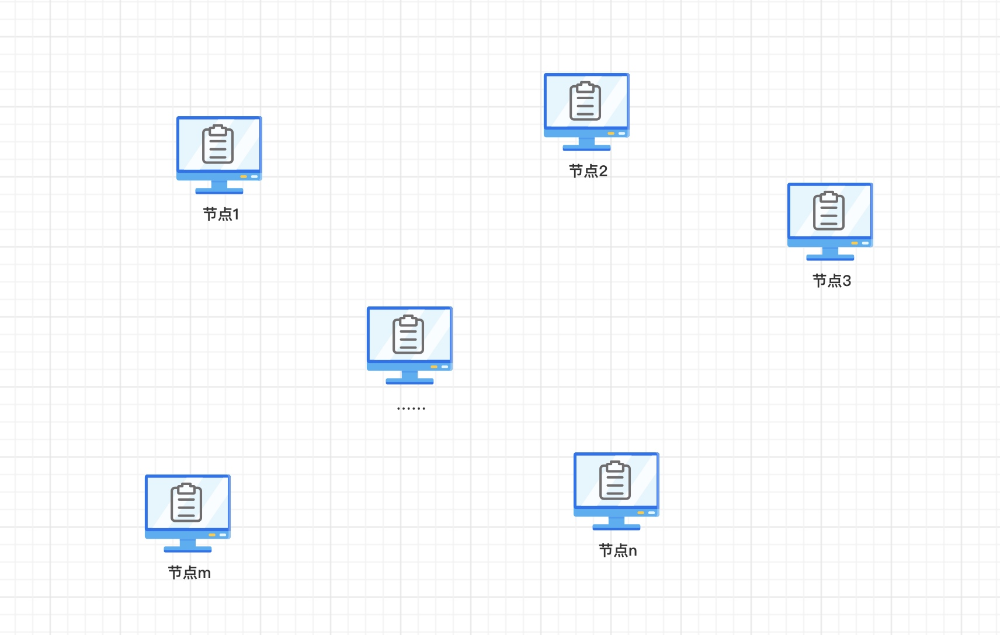

##### 问：没有太懂，首先为什么每个节点都保存完整的账本而不是一部分，为什么这么设计？
就是这么设计的，这是由系统其他的设计（如链式数据结构）所综合决定的。暂时可以这么认为：如果不这么设计，那就不叫区块链了。

##### 问：哦，那既然每个节点都保存着完整的账本，这样每个节点上存的数据量不会很大吗？
账本存储的都是文本内容，对于当今的计算机是能够处理的了的。

##### 问：那怎么保证每个节点上的账本都一样呢？
这个问题暂且搁置，后面会说到。区块链设计了机制来保证每个节点的账本都一样。

##### 问：那为什么节点要耗费自己的计算资源和存储资源去记账？有什么好处呢？
原来记账的是会计，那会计为什么记账？因为有工资啊。同样的，记账的节点会获得奖励，有一种奖励就是比特币，现在能当钱花。也有的叫做代币，从名字上看也能当钱用。

#### WHEN：什么时候记录？
##### 问：哦，现在我知道了，账本是由每个节点来记录和存储的。那他们什么时候记账呢？是实时记账的吗？
并不是的，每个节点会每隔10分钟左右进行一次记账，类似于批量处理。大致过程是这样的：

假设，有一个用户A，想要转50元给用户D。
1. 用户A告诉其附近的节点1，说我要转50元给用户D，于是便生成一个转账记录，这条转账记录被称之为**交易**。
2. 每个节点都会收到客户端/用户以及其他节点广播的交易信息，然后放入自己的收件箱中。因此节点1收到交易后，会放入自己的收件箱中，并且还会把这条消息广播给跟自己有联系的其他节点。
3. 然后节点会验证这条交易信息是不是有效。那验证什么呢？主要有：这个请求是不是A发起的？A账户里有没有足够的100元？B账户是否存在？
4. 验证交易是有效的之后，节点会把交易放入到一个列表里，暂时叫做待记列表吧。
5. 每隔大概10分钟左右，节点就会把待记列表里的交易信息打包在一起进行记账。

图2：节点处理交易流程
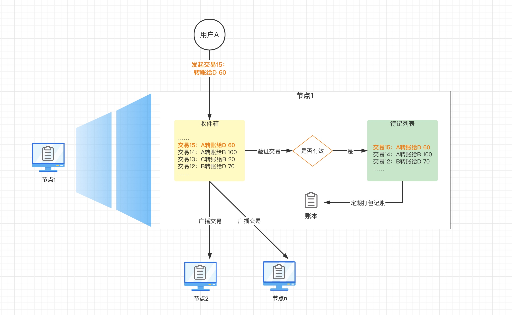

##### 问：这个过程里有几个问题，首先怎么验证交易是否有效？什么交易是有效的呢？
我们现在转账需要校验什么呢？无非是以下几点：
1. 转账双方的账户是不是存在
2. 转账账户的余额是否足够
3. 转账时输入的账户密码是否正确
   这些在区块链的交易中也一样需要验证。

##### 问：这里面账户比较容易理解，就和我们的银行卡号一样。但是密码验证就难以理解了，有银行的时候，我们的密码是发给银行去验证的，银行会保证密码不泄露出去。但是现在没有银行了，那我的密码怎么能随便发出去呢？
这就要涉及一个加密技术了：非对称加密。在非对称加密里，有2套秘钥：公钥和私钥。顾名思义，公钥是公开的，谁都能获取的，私钥是放自己手里的。非对称加密有一个特性：**用私钥加密的内容，用配对的公钥可以解密出来。**
因此，账户A转账时，并不是把密码告诉系统，去让系统验证。而是用私钥加密交易信息。就是说 A会把“A转账给D 50”这条信息用私钥加密，然后把密文发给节点。节点用公布出来的A的公钥，来解密这段密文，如果解密成功，那就能证明这个交易确实是A发出来的。因为用B的公钥是无法解密的。
这样加密还有一个好处，就是这个交易信息在网络上传播时，不会被篡改，因为改完还得用A的私钥加密，这个私钥是无法轻易获得的。
这个加密的过程也被称为签名。

图3：交易的加解密
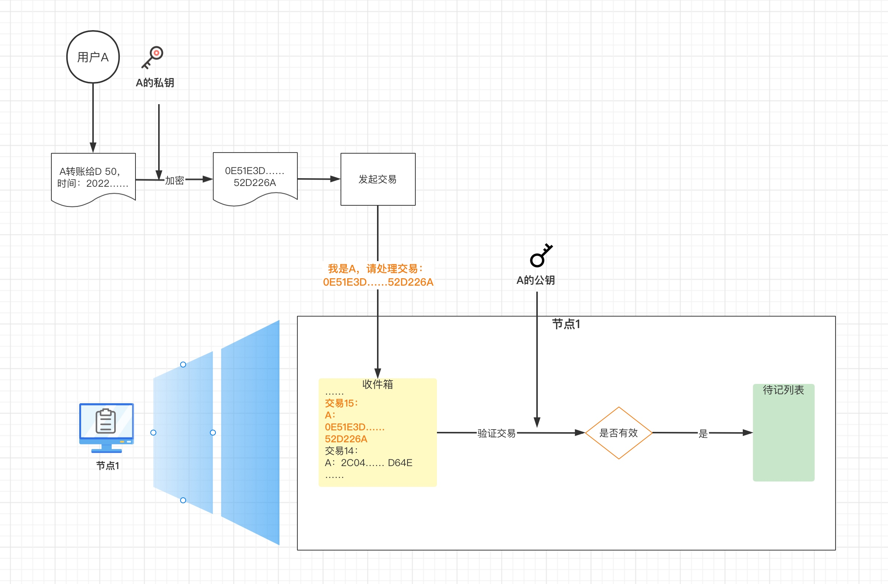

##### 问：那为什么是10分钟记一次？而不是1分钟或1小时？
这个10分钟是个举例，在比特币区块链系统中是10分钟，其他区块链系统不一定是这个。至于为什么要隔一段时间处理一次，后面还会涉及到。大概原因是，节点记完账是要跟别的节点同步的。如果间隔时间太短，每个节点收到的交易信息容易不一致，那大家很容易记的都不一样，就不容易保持一致。如果间隔太长，跟其他节点同步的频率就会降低，记账就会太慢。

#### WHAT：记什么？

##### 问：那节点记录的账本是什么样的呢？
上面说到，每隔一段时间，节点就会把一批交易进行**打包**记录，然后进行记账。打包之后的这一批交易信息，就被称为**区块**。
区块里包含了很多信息，区块的数据结构如下：
* 区块头
    * 父区块哈希
    * 版本/高度
    * 时间戳
    * 难度
    * 随机数/nonce值
    * 默克尔根
* 区块体
    * 保存交易信息的默克尔树（Merkle Tree）

图4：区块的数据结构
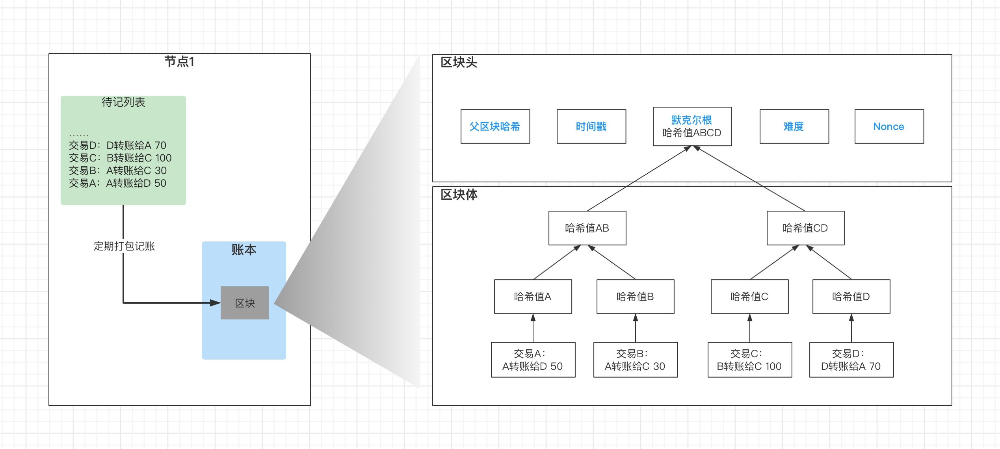

##### 问：为什么交易信息要用默克尔树的结构存呢？放进一个列表不行吗？
用默克尔树这种数据结构保存的交易信息，主要目的是为了验证交易信息的正确性，是否被篡改过。
想要了解默克尔树，首先得了解下哈希算法。
**哈希算法**是一种单向加密算法，这里面有2个关键词：加密和单向。加密是指：哈希算法能把一大段长的文本转换成固定长度的字符串，并且相同的文本转换后的值是一样的；单向是指：即这个过程是不可逆的，也就是说不能根据转换后的字符串（即哈希值）恢复或推算出原来的的文本。因此，这些特点使得哈希算法可以被用来验证消息是否一致。
相同的哈希值，说明其原始文本也相同，因此在区块链系统中，可以认为相同的哈希代表的相同的交易。如果有人想改一笔交易内的信息，那么哈希值就会发生变化，也就防止了交易信息被篡改。如下图所示：

图5：哈希算法
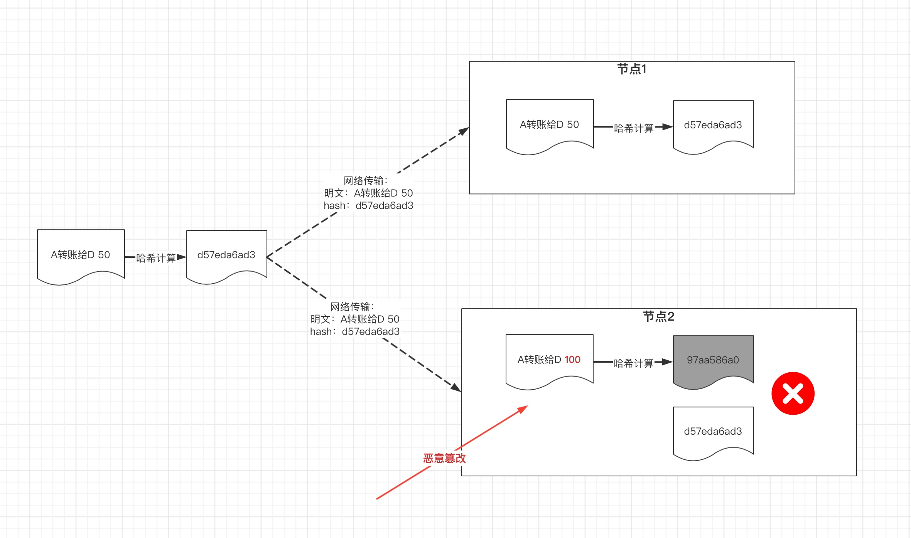

在区块链系统里，通常使用SHA–256算法来进行哈希计算。这是一个安全性非常高的算法。
相同的哈希代表的相同的交易，因此每笔交易都可以用哈希值来代替，而**默克尔树**就是把一批交易组织起来的一种形式，默克尔树又称为二叉哈希树（Binary Hash Tree）。即最底层是交易的原始信息，然后层层做哈希，最终得到1个哈希值，这个值就是**默克尔根**。
默克尔树的这种结构特性，会使任何一个交易的修改，都引发连锁反应，上面的哈希值被逐层修改，最终默克尔根也就不一样了。如下图所示：

图6：默克尔树
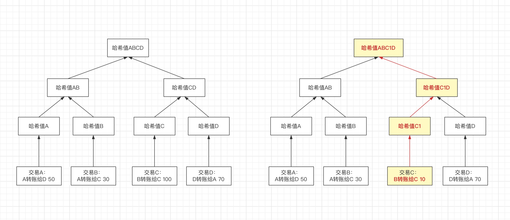

所以通过默克尔树可以快速地校验数据是否被修改过。当然不用默克尔树也能校验交易是否被修改过，只要一个个的遍历检查就行了。但这样太慢了，默克尔树是为了使系统能快速进行校验。

##### 问：为什么要记其他那些信息？有什么用呢？比如父区块哈希？nonce值又是什么？
这些信息主要的目的都是为了保证信息的安全性，即不能被篡改。父区块哈希和nonce值后面会做解释。

#### HOW：怎么记？

##### 问：哦，那这些信息是怎么来的呢？是节点想写什么就写什么吗？或者说节点怎么确定这些信息呢？这些信息从哪来呢？
哦，当然不能了。
这就需要了解节点的记账流程了。我们看看一个节点是怎么记账的。这是区块链最复杂，最核心的部分。
每个节点记账时，都是只管记自己的，也就是说并不知道其他节点正在记什么，因此记账时，或者说打包区块时，所使用的信息都是节点已掌握的信息。

之前提到，每个节点都是每隔一段时间比如10分钟，把一部分交易信息打包成区块。因此打包成的区块其实只是这个账本的一部分或者一些片段。
但之前也说，每个节点上保存的都是完整的账本，那怎么把整个账本拼凑在一起呢？
区块的数据其实也是一大段的文本信息，因此为了防止区块信息被篡改，也要对其做哈希算法，因此得到的哈希值就是这个**区块的地址**。
在区块的数据中，可以看到有一项是父区块哈希，可以理解为指向上一区块的地址，有了这个地址，整个账本就能像串糖葫芦一样串起来，即我们能从最新的区块，一块一块地往前倒，最终获取到整个账本。
如下图所示，这样看上去像一条链一样，这也是**区块链**名字的由来。区块链的账本就是这样拼凑在一起的。

图7：区块链的链式结构
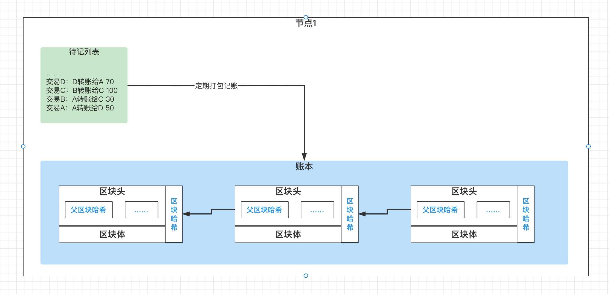

##### 问：到现在，我们才看到了账本的形式。但是问题来了，如果每个节点各记各的，那大家能保持一致吗？
节点记账是各记各的，但是不能只存储在自己这，这样会造成每个节点上的账本都不一样，那查的时候就没法弄了，不知道以谁的为准。因此节点打包好区块后，还会把区块广播出去，跟其他节点保持同步，那同样的，其他节点也没闲着，他们也在打包区块进行记账，打包完也会广播出去。
因此，节点不仅自己产生区块，还会接收到其他节点打包好并广播的区块。

为避免后面陷入细节和分支中，先来说说区块链系统记账的总体流程或主干流程。
假设我们处在一个完全理想的环境下，即网络没有延迟，每个节点都各司其职，那区块链如何记账呢？
大致流程如下：
1. 节点1取出一部分交易，然后打包成区块A，记录并广播给其他节点
2. 由于我们假设网络没有延迟，因此其他节点会马上收到节点1发来的区块A
3. 于是所有节点都会把区块A追加到区块链的最后，并放弃正在打包的区块，重新开始。
4. 节点3 打包好了区块B，然后广播，其他节点把区块B追加到最后

图8：系统的总体流程/主干流程
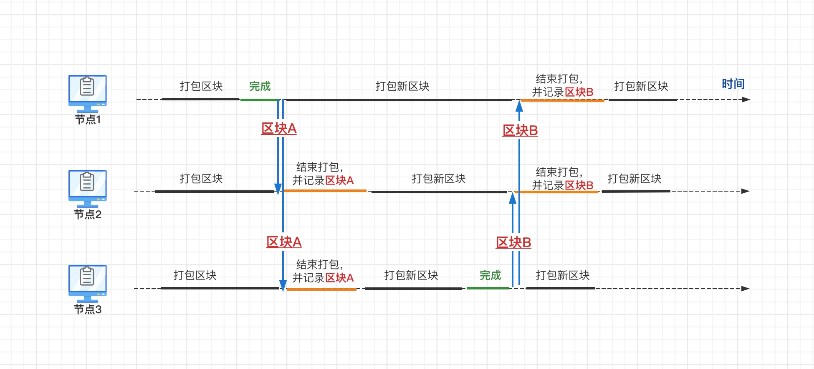

在理想情况下，由于各个节点的行为都是完全一致的，因此每个节点上的账本即区块链也会完全一致，一模一样。
如下图所示：

图8-2：节点间的交互
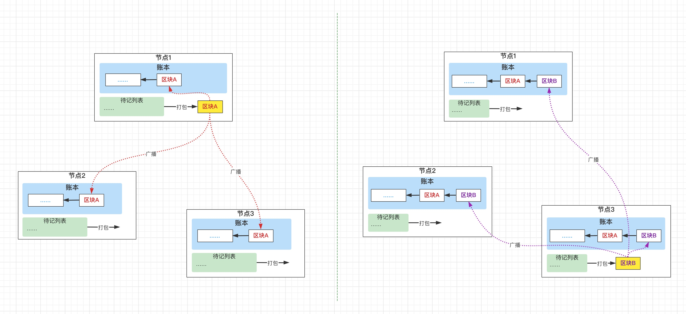

##### 问：理想情况下比较好理解。那实际情况下呢？
真实情况下，主要有2个问题：
1. 网络有不同情况的延迟，也会有不能送达的情况
2. 节点并不都是诚实的，一定会有恶意节点

##### 问：嗯。那先说说网络的问题吧，网络问题会导致什么情况呢？
网络延迟或故障，会出现以下问题：每个节点收到的区块会不相同，有的收到的多，有的收到的少，收到的顺序可能也不同。
并且节点不会跟系统里的每个节点都连接，只会和附近的几个节点相连，这样区块在传播的时候，就有点像微博的转发了，类似一传十，十传百的这种。
因此，可以想象，在节点组成的网络中，会有各种区块满天飞，有效的，无效的，延迟的，重复的……
于是各个节点收到的区块也是不一样的。

图9：区块传播图
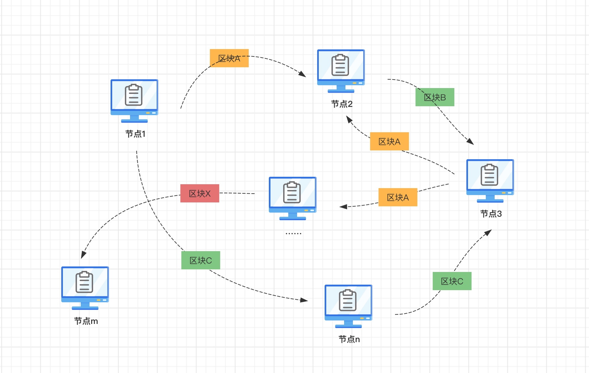

##### 问：收到的区块不一样，那怎么保证各个节点能够保存一样的账本呢？
这就涉及到了一致性共识问题了。有很多算法能解决共识问题，其中一个是PoW（Proof of Work）共识算法，也就是工作量证明算法，比特币系统中就是使用了这一算法。

通过PoW达成共识的主要原理如下：

每次记账或打包区块时，先要算一道题，这个题并不好算，需要耗费一定的时间/工作量，算出答案后才能把打包的区块发布出来。
算这道题的主要目的是把每个节点打包的时间叉开，防止多个节点同时发布区块。试想：如果每个节点都同时发布区块，那么将导致有很多不同的版本在网络上传播，这样整个网络就很难达成一致了。
其实工作量证明的本质是确定区块的优先级/权重，在PoW算法中，谁先算出来那么这个块的优先级/权重就高。因此共识算法除了工作量证明算法，还有PoS（Proof of Stake）算法，即权益证明共识算法，在这个算法里，哪个节点投入的“股份”高，其打包出的区块的优先级/权重就高，也就是我们俗称的“谁股份多谁说了算”。

##### 问：为什么PoW就能使集群最终达成一致呢？
举一个不太恰当的例子：
在微博里有一个圈子，有100个周杰伦的粉丝，有一天，一个粉丝首先发了一条微博说“周董出新专辑了，名字叫《最伟大的作品##### 问：”，然后有20个人看到了并做了转发，然后，有人发了一条微博说：“周董出新专辑了，名字是《渺小的我##### 问：”，这时候也许有10个人看到并转发了，但同时之前的微博已经陆续被50多人转发了，这样，大家逐渐会形成共识，相信专辑名字是《最伟大的作品##### 问：，《渺小的我##### 问：会逐渐被人遗忘，之前转发过这个错误微博的人也会默默删掉转发的微博。在这个场景里，谁发微博的速度快，发的早，这条微博就占据更大的优势。
所以达成共识，不是立刻达成的，而是经过一段时间后，大家最终会达成一致。

图10：PoW与达成共识
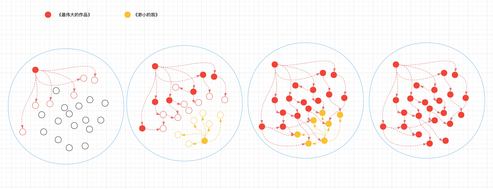

##### 问：哦，之前一直在说答题答题，那到底是什么样的题呢？题目是谁出的？答案在哪呢？
这里的题是指**哈希难题**，大概就是：
请你找到一个数x，然后计算此区块的全部交易信息+x的哈希值，使计算出的哈希值前3位（可以换成任意n位）都为0。
由于哈希算法的特性，这个题没有好的解法，只能暴力破解，即先让x=0，然后计算交易信息+0的哈希值，看前3位是否全是0，如果不是，那就让x=1，然后再算，再判断，假设直到x=2022时，发现算出的哈希结果是000Xnqb……Idc，符合开头是3个0的条件，便找到答案了，答案就是2022。

验证答案也很简单，只要拿原始的信息+答案，算一下哈希值，看看开头是不是3个0就行了。

由于答题时，交易信息里包含了时间戳还有其他的信息，因此每个节点的答案都不是确定的，同一批交易信息，有的节点算到10就算出来了，有的算到100000也算不出来。所以能成功答题的节点就相当于是随机的。不会出现一直是某个节点先答对的情况。

##### 问：x一定要从0开始算吗？
当然也可以不让x从0开始，而是随机选，如果开始就让x=2022，得到正确答案，那只能羡慕和恭喜了。但是从概率上讲，这就跟你买彩票，是按顺序选，还是随便选几个数字，中奖的概率是一样的。

##### 问：这哈希难题这么浪费资源，图什么呢？
之前也说过，为什么节点会给系统记账？是因为发布有效的区块会有奖励，比如比特币或者某种代币，正是因为有利可图，因此节点的目的或动力就是产生有效的区块，这就是我们常说到的**挖矿**，其实就是利用计算资源来破解哈希难题。
但是挖矿是有难度的，每个节点都在埋头计算，但是区块链里面有个**原则**，就是一旦节点收到其他节点算好的结果即发布的区块，便需要立刻停下手里的计算工作，去验证答案是不是正确的，以及区块是不是有效的。如果是有效的，便把收到的有效的区块记录或追加到原来的链上，那自己之前的计算也就没用了，需要重新开始下一轮的解题。
（注：由于解哈希难题所需要的计算及其简单，因此GPU更适合用来挖矿。为什么呢？有一个比喻说，CPU类似1个数学家，1分钟能算1道复杂的数学题，50道10以内加减法，而GPU则是1万个小学生，1分钟能算10万道10以内加减法。）

##### 问：啊？只能有1个节点算的结果有效，其他的都白算了，那岂不是很浪费资源吗？
没错，基于PoW共识算法的区块链就是会非常浪费资源。于是在其他区块链系统里，才做了优化，比如有PoS（Proof of Stake）权益证明共识算法。

##### 问：即便如此，由于有非常多的节点同时在计算，还是可能出现几乎同时算出答案的情况吧？
是的，会出现几乎同时算出的情况，也就是2个节点几乎同时发布算好的区块；或者是由于网络问题，某个节点并不知道已经有节点算出答案了，因此会一直算直到得出答案，并以为自己是第一个算出来的，然后也把区块发布出去。如下图所示：

图11：区块分支的产生
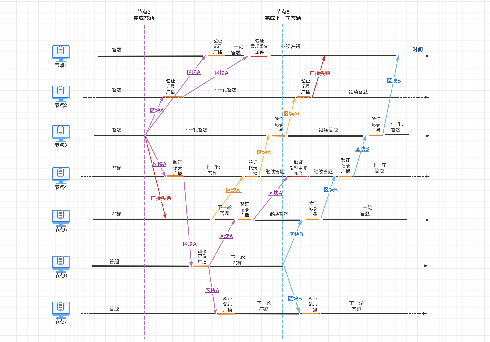

你看，在上图中，节点2和节点4都会先后收到好A和A1这2个区块，这2个都是正常打包的，都可以通过验证，里面的交易也都是有效的。

##### 问：那该以谁发布的区块为准呢？按时间戳吗？
不行，因为时间戳是节点自己打的，大家的时钟并不同步，不可靠。
##### 问：按收到的先后顺序吗？
不行，因为由于网络的延迟，收到的顺序不能代表算出的顺序。
##### 问：那该以哪个为准？
其实，节点并不会从中挑选一个区块，追加到当前链上，而是会把这些区块都追加到当前链上。
在上面的例子中，区块A和区块A1，都会指向同一个父区块：区块F。因此区块A和区块A1都会被链接到区块F上。
因此如下图所示，节点上的区块链账本并不是一条纯的笔直的链，而是带有分支的。

图12：区块链的分支结构图
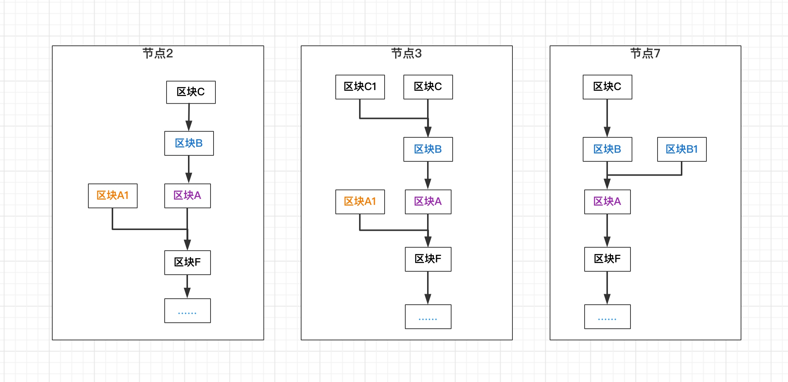

由于存在分支，且每个节点上的分支可能会不同，所以**节点上的区块链并不是完全一致的。**

##### 问：节点上的账本不一致，那当我们在查询的时候，该以哪个分支为准呢？
在这里，为了达成一致，区块链还制定了一个大家都要遵守的原则：即**最长链原则**。就是最长的链就是最权威的链。比如在上面的图里，C -> B -> A -> F -> …… 最长，因此就是最权威的链。

##### 问：最长链原则的原理是什么呢？或者说为什么最长链就能代表最权威最正确的记录呢？
这里面其实暗含了一个假设，即大多数的节点都是正常工作的节点，是没有异常或不受控制的。
最长链原则的思想就是相信群众的力量，即大家都在不停往链上加区块，“众人拾柴火焰高”，同样的道理，“众节点造块链最长”，因此群众做出来的链永远都是最长的，也即最长的链是最权威的，是最值得信任的。

##### 问：那这个分支要分到什么时候才算结束呢？总不能一直分叉，一直挂在链上吧？
非主干上的区块不会一直挂在主链上，每隔一段时间，节点就可以进行清理。在比特币系统中，认为6个区块以前的区块不会再被修改，因此从最长的分支往前数6个区块，这之前的链会被认为是权威的链，也就是说其中的交易会被确认，也就是板上钉钉，不能改了。

##### 问：为什么往前数几个区块的交易才算被确认的？
由于区块在网络上传播需要时间，因此节点上的最长链可能是不稳定的，如下图所示，在某节点上，可能当前最长链是 C -> B -> A -> F -> …… ，但是随着时间的推移，最长链可能会变成E1 -> D1 -> C1 -> B1 -> A1 -> F -> ……。
区块链保证的是最终一致性，即虽然最终能达成一致，但在某时刻某些数据存在不确定性。

图13：最长链变化
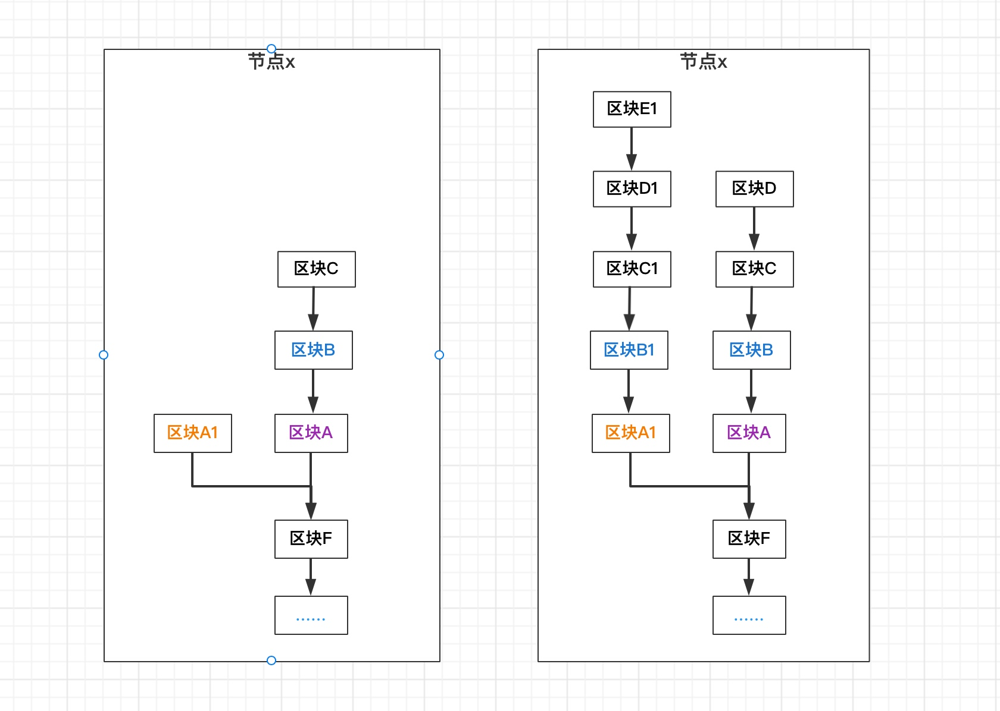

##### 问：为什么是6个区块？
这个6是由概率推算出来的。
大概思路是，先考虑一个极端情况，即从某次开始，每次都会有2个节点同时算出1个区块并广播，那这种情况下，就有可能使区块链出现2个分支，并且每个分支都同步往后追加不同的区块。由于出块前需要答题，即工作量证明，因此同时出块的概率本来就很低，那发生6次的概率发生概率是极其低的，可以认为不可能发生。
（注：由于比特币系统中平均约每10分钟出一个区块，6个块便能确认交易，因此1个小时后交易才会被确认。）

还可以换个角度理解，类似于动态规划的思路，即越旧的链，会越稳定，越难有新区块再追加到其上，因此就越难以在其上产生分支。就是说，突然有个节点发出一个区块，这个区块的父节点指向7层以前的区块，要在到7层以前的节点上形成分支。这个概率很低，但还是有可能发生的，不过即使形成分支也没关系，根据最长链原则，这个区块所在的分支不是最权威的，将来也会被裁剪掉。

到现在，已经解决了真实场景下网络延迟或故障带来的主要问题了。
在真实场景下，还有一类问题，就是不是所有节点都是诚实的节点，一定存在一些恶意的节点，恶意节点的存在，也会影响整个网络达成共识。

##### 问：那恶意节点对整个系统有什么影响呢？
恶意节点可能做的恶意操作主要有3类：
1. 修改交易信息，比如把用户A给用户B的转账改成转给自己的，或者把交易中用户A转给自己的100元改成1000元。
2. 利用交易确认的时间差，透支账户，触发**双花问题**。
3. 利用算力攻击主链，撤销已确认的交易，触发双花问题。

关于第1个问题：
之前说过，其他用户发起的交易信息，都是用自己的私钥签名过的，节点私自篡改交易信息后，没有私钥，是没办法伪造签名的。所以第1点是恶意节点做不到的。

关于第2个问题（利用交易确认的时间差，透支账户，触发双花问题），举个例子：
用户A本来就100，先给B转100，然后趁系统还没有确认这笔转账，再给C转100，这样不就形成透支了？
这就是一类双花问题，即通过交易确认的时间差，把同一笔钱使用2次。
在银行系统里，账户是可以查余额的，而且可以通过事务来解决。
但是在区块链系统里，最开始的时候节点上的信息是不同步的，用户A确实可能既转给B，同时又转给C，因为这2笔交易会发给不同的节点，有的节点会打包转给B的那笔交易，有的会打包转给C的那笔交易。这些节点在打包区块时会有2种情况： 1）2个交易打包在同一分支。2）2个交易打包在不同的分支。

第1种情况下，假设一个交易先被打包进了一个区块并链到了区块链上，这样当在打包第二个交易时，由于当前分支上能查到另一笔交易，然后在验证交易时一算账户里没有钱了，那这个交易就会被认定是无效的，节点便会把这个交易抛弃。就避免了双花问题。

图14-1：双花问题-时间差-1
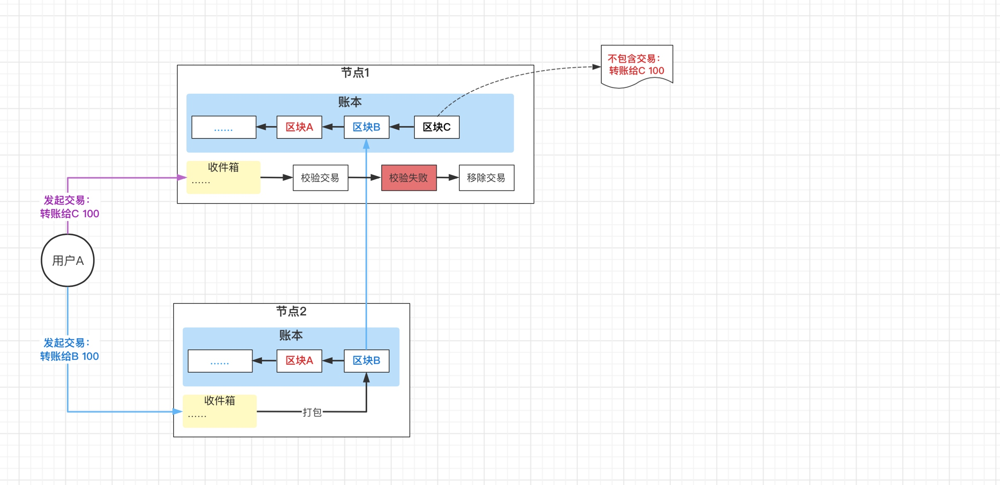

从第1种情况看到，如果2个交易在一个分支上，那必定有1个交易不能被打包进区块，因此第2种情况是，如果2个交易都被打包进了区块，说明这2个交易所在的2个区块是在不同的分支上，即在打包区块时，节点并不知道另一笔交易的存在。那根据最长链原则，6次追加区块后，只有一个分支里的交易会被确认，其他的会被剔除。也可以避免双花问题。

图14-2：双花问题-时间差-1
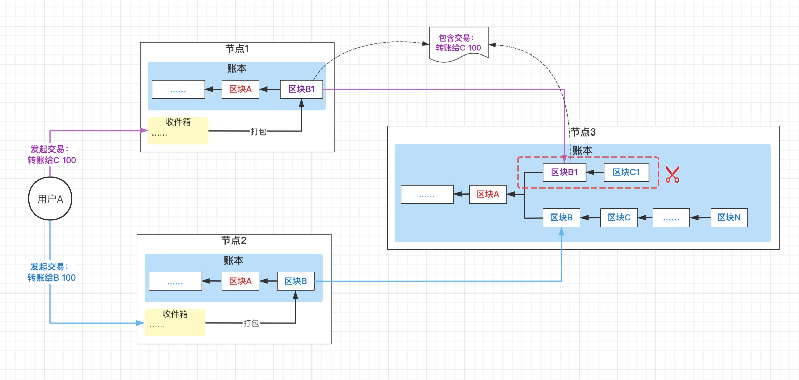

关于第3个问题（利用算力攻击主链，撤销已确认的交易，触发双花问题），举个例子：
用户A先给商家B转100，等6个区块过后，交易被确认，然后商家B把商品发给用户A。用户A收到商品后，开始指挥自己控制的节点，先制造一个没有之前那笔交易的新区块B1，链接到原交易所在区块的父区块上，因此形成新的分叉，然后开始打包新的区块，都连接到区块B1这条分支上，直到追赶并超过之前的主链，根据最长链原则，之前的交易所在的分支就不是权威分支了，将被裁剪掉，其中的交易也将被撤销，用户A等于没付钱。这就是另一类双花问题，即通过攻击主链，撤销支付，不付钱购买到商品。

图14-3：双花问题-51%算力攻击
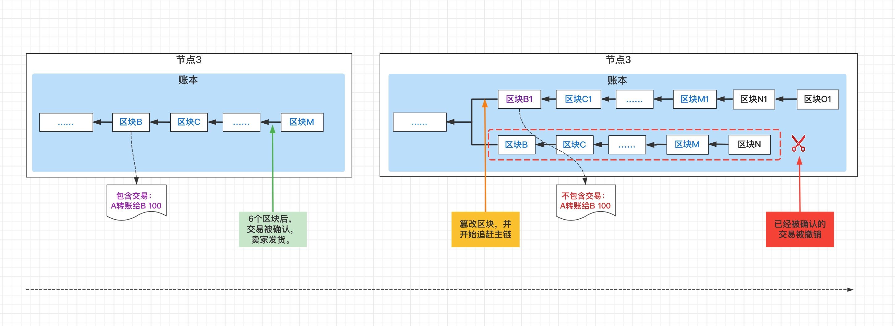

上面说了最长链里6个块之前的交易才会被确认，因此要改之前的交易，那现在开始要改6个区块之前的那个区块，那需要把倒数第7个改了，然后接到前一个区块上，然后再造出至少7个新区块来接到后面。这在理论上是可行的，但这个过程需要耗费大量算力，由于要能追赶主链，所以得有人能控制50%以上算力才行，这是与假设冲突的。
假设即使有人掌握了50%以上的算力，能够操纵交易，但是却消耗了大量的算力，本身就会产生很高的成本。此外，操纵交易会让获得的奖励如比特币的价值缩水，最终让攻击者会得不偿失，得不到好处。

##### 问：那问题又来了，有个节点说我是个正经节点啊，我不造假，也不恶意打包，只是可能比别人晚算出来了一点，那我打包的区块也可能会因为没在最长分支里而被抛弃，那里面的交易怎么办呢？不管了吗？
是的，如果你这个块被抛弃，就形成了所谓的**孤块**。为这个块所付出的计算量就是白费了。
但是其中的交易当然不会被丢弃，不会没人管，否则这系统岂不是很不可靠了。这些交易还会重新发回收件箱，等待下一次打包区块的时候被打包进去。

#### WHY：为什么这么记？

##### 问：听上去有些复杂，为什么区块链要这么设计呢？
当然是为了实现系统的目标了，即建立一个可靠的去中心化的交易记录系统。所有的机制都是为了实现这一目标。
现在让我们从问题倒回去看，区块链为什么有这些设计。
为了实现目标，需要解决哪些问题？
1. 去中心化，因此数据要存储在网络的各个节点上，那如何实现全局共识，保证一致性？
   用PoW共识算法来解决。即谁先完成工作量证明，谁的信息就有了话语权和先发优势，经过传播后，就会被当作共识。
2. 如何保证交易信息不被篡改？
   通过哈希算法及默克尔树来保证区块内的数据不被篡改，通过链式的结构保证整个区块链不被篡改。这里说的不是不被篡改，而是篡改的难度极高，不仅要修改单个区块，还要修改此区块之后所有的区块。
3. 如何防止恶意节点控制系统？
   通过假设，即不可能有人或者机构能控制整个系统50%以上的计算能力。
4. 如何应对网络不可靠导致的区块链分支？
   网络不可靠会导致区块链发生分支。通过最长链原则，可以保证最长的是最权威的链。

### 查帐
##### 问：大概清楚了区块链是如何记录的，但是我发现，其实每个节点上的账本并不是一条纯的由区块组成的链，而是一条带分支的链。那我该如何查这个账本呢？以哪个分支为准呢？
之前说过最长链原则，分支最长的链就是最权威的。

##### 问：哦，那整个最长链就是账本吗？
也不是。因为最新的区块在将来并不一定会被包含进最长链，还有可能会被剔除掉。
想象下面一种场景，在某一时刻，某个节点突然网络异常了，跟国外的节点无法通信了，但跟国内的节点可以通信。此时节点上最新的区块是C，然后所有节点都在计算区块，一个小时内，此节点收到了1个国内产生的区块，然后把它追加到链上。然后网络恢复了，和国外节点一同步，发现这1小时期间，国外总共出了4个块。同步完数据发现，现在最长的链是另一条分支了，而原来的C区块已经不是权威的了，将会被剔除。可参考 <u>图13：最长链变化</u>

因此，最新的区块不能算作账本的一部分。在比特币系统中，需要向前数6个区块，这之前的链才算最权威的链，才能算作账本。

##### 问：此外还有一个问题，就是区块上记录的都是交易信息，我怎么能查到余额的信息呢？
在比特币系统中，是没有余额信息的，里面记录的都是转入和转出的交易信息。所以想要查看某个账户的余额，得从第一个区块开始往下捋，就像银行里面的交易记录查询一样。这种记录方式称为：UTXO（Unspent Transaction Output）模型

图15：区块链中的账户
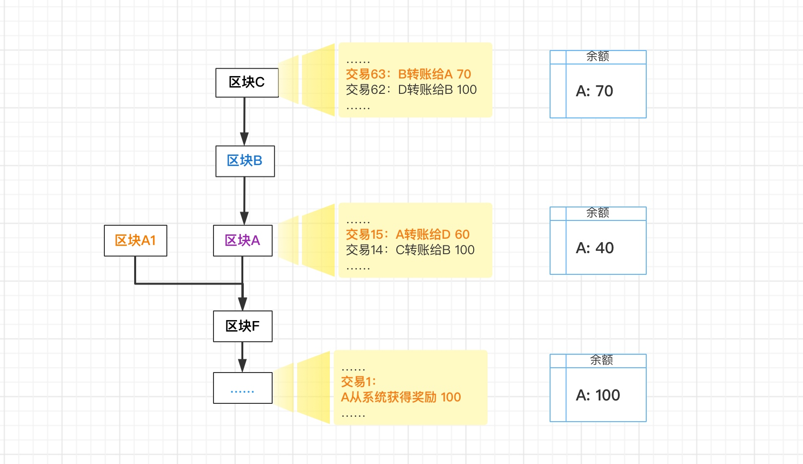

### 帐本是什么

##### 问：区块链只能用来记账吗？

并不是的，区块链是个底层的技术。由于其去中心化的特点，产生了很多的衍生品，主要有这么几个：数字货币、智能合约、NTF、元宇宙。

数字货币
在区块链里记录的是账本信息，这里的区块链系统跟银行的角色是一样的。比如比特币、狗狗币等等。

智能合约
在区块链里记录的不是账本了，而是一段脚本或者一定的程序。这能干什么呢？顾名思义，这解决的其实是合约执行的问题。传统情况下，我们签订一个合约，比如朋友以汽车为抵押，借了我10万块钱，他给我写了个借条，说1年后还，还不上车就是我的了。然后1年到了，朋友没有还钱，也联系不上了，但车还在。这时候我需要拿着借条去找法院，让法院把车判给我。法院其实是我们所信任的中心机构。
但是在区块链场景下，是这样做的，我和朋友在区块链里发布一个智能合约，里面是一段程序，程序会在1年后运行，运行时，先检查朋友是否还了我的10万块钱，如果还了，则合约结束，如果没还，则把汽车的所有权转让给我，合约结束。由于区块链不能被篡改的特性，谁也不用担心会赖账。这样就省去了法院这个中心角色。智能合约最火的就是以太坊。

NFT（None Fungible Token，通常被译成非同质化通证）
在区块链里其实什么都能记，各种类型的文件，于是大家的脑洞就被打开了，能不能在链上记录一个照片呢？于是NTF就产生了。那可能就要问了，我在链上存照片干嘛呢？防止照片被篡改吗？有什么意义呢？确实在链上存个文件并没有什么意义，其实在链上存储的是你对这个文件的所有权。也就是说，这张照片是你的。也许更难理解了，怎么能保证这个照片是我的呢？如果我在网上给人看了，别人一复制粘贴，不就跑他电脑上了吗？怎么能保证这就是我的呢？
确实区块链不能保证你在链上的文件被复制走，其价值在于区块链背后的共识，即大家都认同这个照片是你的。如果你拿这个照片只为了自己看，那这种共识对你也没有任何意义，但如果你是个摄影师，拍出来的照片要卖钱的，这时候就有意义了，别人即使复制了你的照片，也只能自己看看，如果他想要卖，这时在区块链系统的规则下是不行的，没有人认同照片是他的，所以他根本卖不出去。可以看出，这在很大程度上保护了知识产权，对于创作者是很友好的。于是各种创作者一拥而上，画画的出来设计头像放进链里，摄影的把照片放进链里，搞音乐的把新歌放进链里。

元宇宙（Metaverse，Meta+Universe）
大家的脑洞进一步大开，我们能不能把整个世界都搬到区块链里？于是元宇宙的概念就产生了。进入元宇宙的还是人，人是社会动物，是需要组织的，在元宇宙里，人的组织形式是DAO，即去中心化自治组织（Decentralized Autonomous Organization）。那人聚集在一起，干点啥呢？于是根据做的事情，各种形式DAO就出现了。我们得买地建造城市吧，于是有了CityDAO，一伙人聚在一起买地分地。有人有才华，画画好，于是有了创作的DAO，有人喜欢学习，还有学习的DAO。人类能干的事太多了，于是元宇宙里有各种各样的DAO。
那可能会感觉：这元宇宙听着像论坛一样，跟论坛有啥区别呢？元宇宙的底层也是区块链技术，区块链的特点是去中心化，这里的中心就是论坛里的管理员。在元宇宙的组织里，是高度透明和高度共识的。举个不太恰当的例子，我们现在在论坛上发表一篇文章，会经过程序自动审核或者管理员人工审核的，以防你的文章里包含反动或者迷信的内容，所以在审核通过之前，论坛里的成员是看不到的。但在DAO里不是这样，文章发出来，大家都会看到，然后一起讨论并投票，来决定能不能发表。
那你也许会说，这有什么呢，我们的xx小组，也是什么事都大家商量投票决定，也是很民主的。你可以这么理解，元宇宙是有技术保障的民主的组织。

---

**注**：讲解中未做特殊说明的，以比特币区块链系统为例。此文仅为科普入门而写，且其中有一些未经考证，如有不严谨之处，敬请谅解。