# 1 通用能力


edgex的SDK和代码框架中，提供了一些基础能力，如从配置文件读取配置，使用service client调用其他服务，构建消息pipeline等。


## 配置读取

* edgex的配置文件使用toml的格式
* 通常放在和main.go同级的res包下面
* 可以通过目录来分割不同的profile或者运行环境。在启动时可以用 -p xxx来激活不同的配置文件。


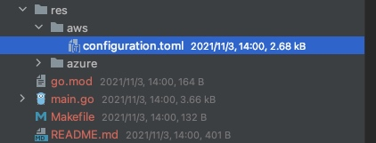


### 自定义配置项

可以在配置文件中以toml的格式加入自己的配置项，

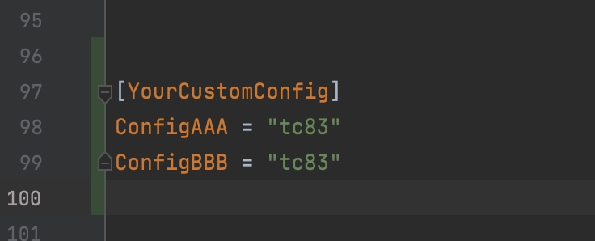

并在系统启动时，通过service.LoadCustomConfig方法加载进来


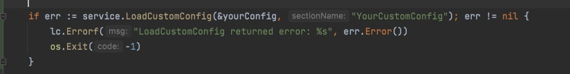

当然，配置的项应该与配置文件中保持一致。

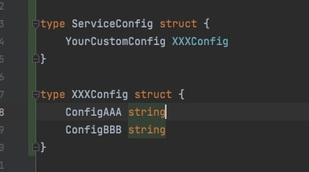


### 环境变量覆盖配置


配置的加载过程经过的方法大致如下：

```go
1. main.go: pkg.NewAppService(serviceKey)
2. service.go: service.Initialize()
3. service.go: bootstrap.RunAndReturnWaitGroup()
4. bootstrap.go: configProcessor.Process()
5. config.go: envVars.OverrideConfiguration(serviceConfig)
```

结合下面的源码中，可以看到，**edgex最后会以环境变量中的配置替换配置文件中的配置**。

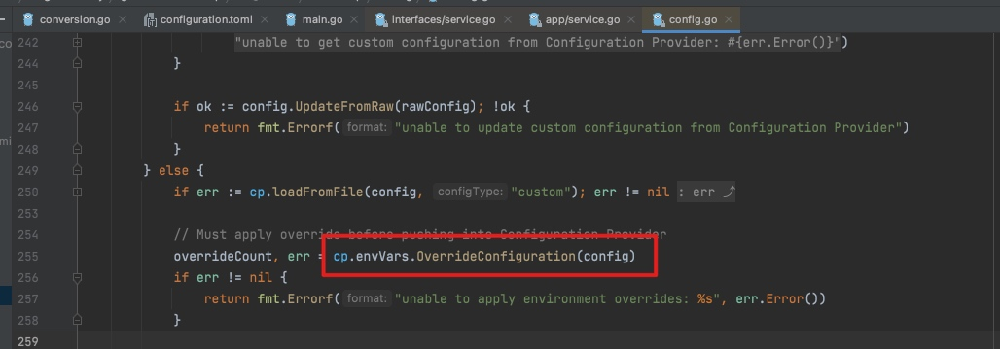

这在docker-compose的配置文件中也能看出一些端倪。也可以看出：

* 配置项的key是忽略大小写的
* 在环境变量中，使用下划线_分割层级

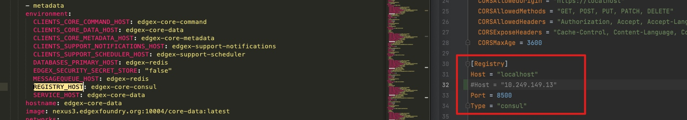


这项能力能够实现根据不同的环境，使用不同的配置，不需要为每套环境都构建一套docker。

## 服务间调用

edgex将系统自带的服务进行了封装，可以像调用本地方法一样实现服务的调用。

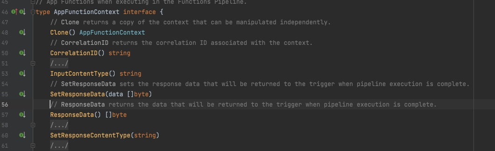


### 使用

比如在处理消息时，需要查询设备的profile信息，则可以：

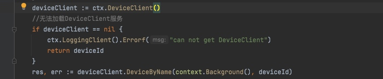


### 配置

使用这个前提是，在配置文件中配置了服务的地址。DeviceClient的API是属于core-metadata服务的，因此要配置core-metadata的地址。

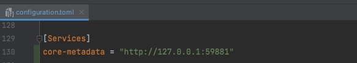

当然注释中也说了：

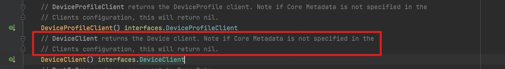


## 消息处理总线messagebus

edgex可以通过service.SetFunctionsPipeline()方法构建一个消息处理的管道。

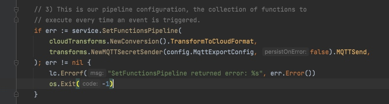


我们可以在管道中加入自己的处理过程，这个等后面自定义自己的application的时候再细说。tion的时候再细说。