# 2 自定义设备服务

edgex只提供了一部分的设备协议的适配，包括：device-camera、device-snmp、device-mqtt、device-modbus、device-gpio、device-coap、device-uart、device-grove。

那实际使用中一定会需要适配其他协议，如接入纯TCP协议的设备，或者对原有协议进行改造，比如非标准modbus的设备。

在写新的device-service的时候，通常不需要创建空白的新工程，就拿现有的工程，如device-modbus-go或device-mqtt-go进行改造就可以了。

本节以device-modbus-go为原型，开发一个自己的设备服务，接入TCP协议的设备。

## device-service工程结构

以device-modbus-go为例，

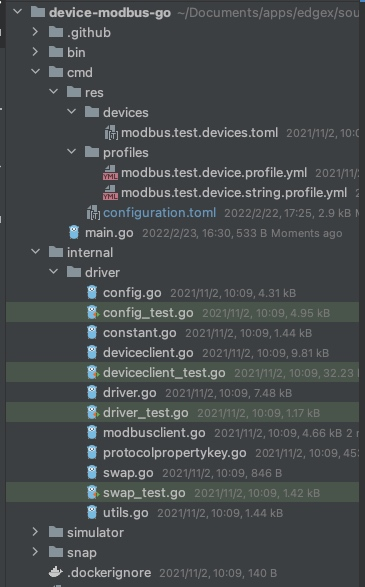

其中：
/cmd/res/devices/* ： device数据文件，edgex启动的时候会根据这个目录下的内容去初始化设备
/cmd/res/profiles/* ：profile数据文件，edgex启动的时候会根据这个目录下的内容去初始化设备profile
/cmd/configuration.toml: 配置文件
/cmd/main.go: 主文件
/internal/driver/*：最核心的部分，协议驱动包，实现了与设备的网络通信，以及数据的解析。自定义设备服务，也主要是修改或者扩展这个包下的内容。

## 数据流

device-service的主要任务是完成设备数据的采集，并发送到edgex的pipeline。

### 从哪来？

设备的数据上报通常有2种类型：1）被动采集式的和 2）主动上报式的。
比如modbus属于典型的被动采集，也就是说设备不会主动上报数据，而是等收到外部发给它的采集/读指令，然后才发送对应的数据。
而一些TCP协议的气象设备或者MQTT设备，则能够具备以固定的频率向指定目标发送数据的能力。

对于主动上报的设备，只要做好接收和处理，然后发送到edgex的pipeline就可以了。
对于被动采集的设备，如果要融入edgex体系，则要与其内部的机制进行对接。

edgex可以按照不同的设备的不同的属性去发送数据采集指令。首先需要在device的定义时，在`autoEvents`中配置采集间隔。

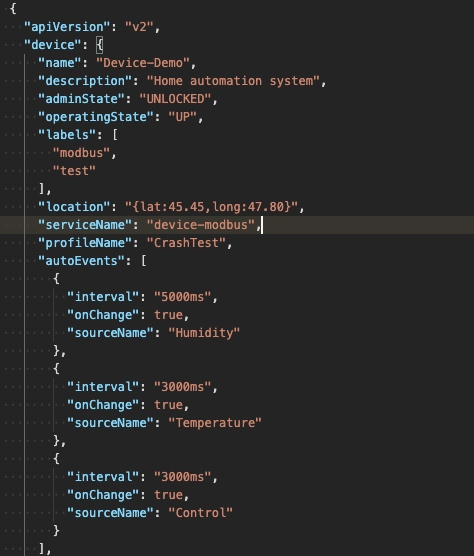

在device-service启动后，会读取关联到此device-service的设备列表，然后给每个设备的autoEvents的配置项开启一个协程去定期发采集指令。

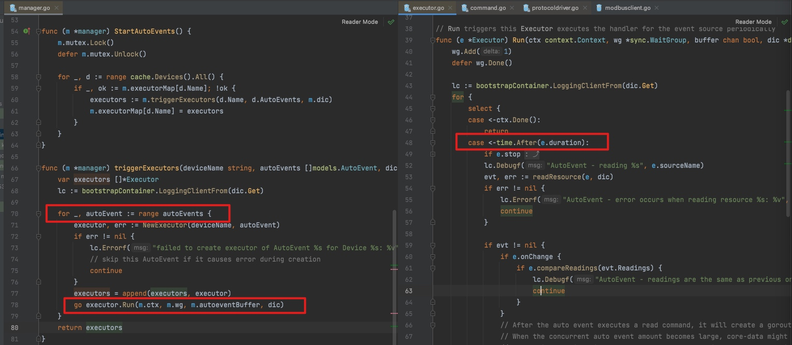

在上面的`readResource()`方法后面，通过层层调用（application.CommandHandler -> helper.ReadDeviceResource -> driver.HandleReadCommands ），调用到driver.HandleReadCommands()。而此方法是要根据不同的协议去实现的。

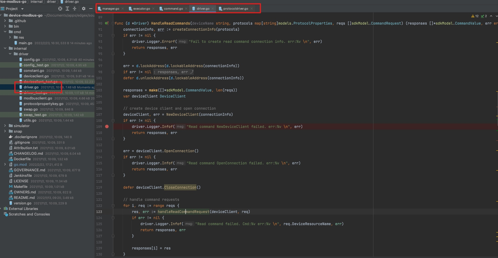

从工程结构上也能看出，之前的方法都是SDK中的方法，而最后一直调用到的HandleReadCommands()方法是driver.go中实现的方法。

通常我们需要在这个方法内，实现对采集指令的封装，以及响应的解析，而与设备的通信，则由deviceclient.go去实现的。

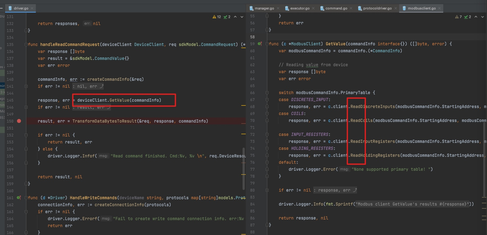

### 到哪去？

采集到数据后，通常需要在driver层包装成`sdkModel.CommandValue`数组， 返回给SDK中的ReadDeviceResource()方法，然后在此方法中，`sdkModel.CommandValue`被转换成`dtos.Event`

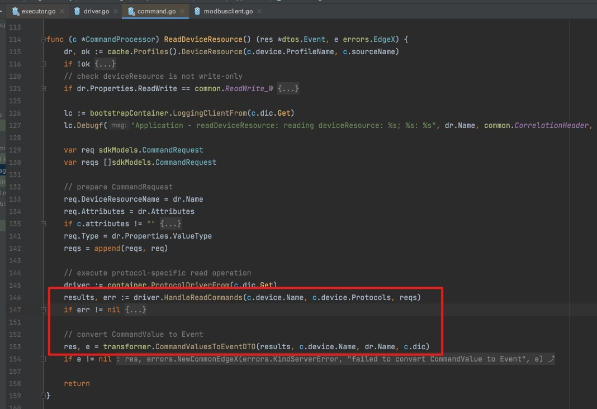

通过向上层层追溯代码（ReadDeviceResource -> CommandHandler -> readResource -> Run -> sdkCommon.SendEvent ->  mc.Publish(redis/client.go的实现) -> c.publishClient.Send ），可以看到，数据最终是被发到了redis中，即edgex的默认pipeline中。

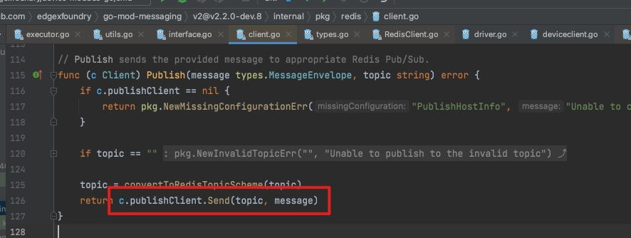

### pipeline集成的扩展点

上面的流程是device-modbus中的从设备到redis channel的完成数据流。我们实际开发过程中的并不需要直接与redis进行交互。把采集到的数据汇入edgex pipeline有以下几种方式（我所知道的和用过的）：

#### 实现driver的HandleReadCommands，并返回CommandValue数组

这个就是上面介绍的流程，参考了`device-modbus-go`工程中的实现。

#### 对接到异步消息管道

device-service启动时，初始化了一个models.AsyncValues类型的channel，并启动了一个协程去从里面取消息，包装成dtos.Event后发送到redis中。

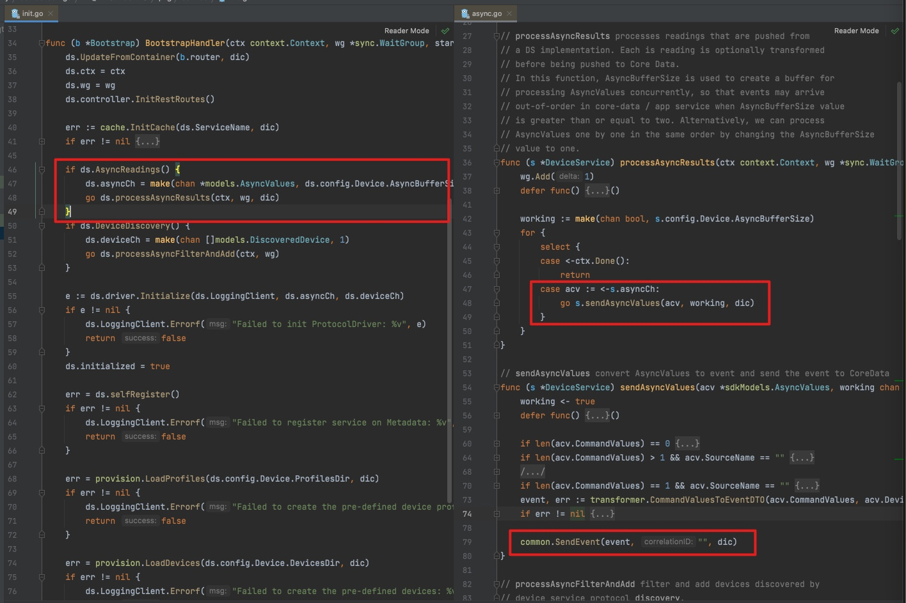

因此，我们也可以把采集到的数据封装成`models.AsyncValues`，发送到driver.AsyncCh管道即可。`device-mqtt-go`工程中就是这样实现的。

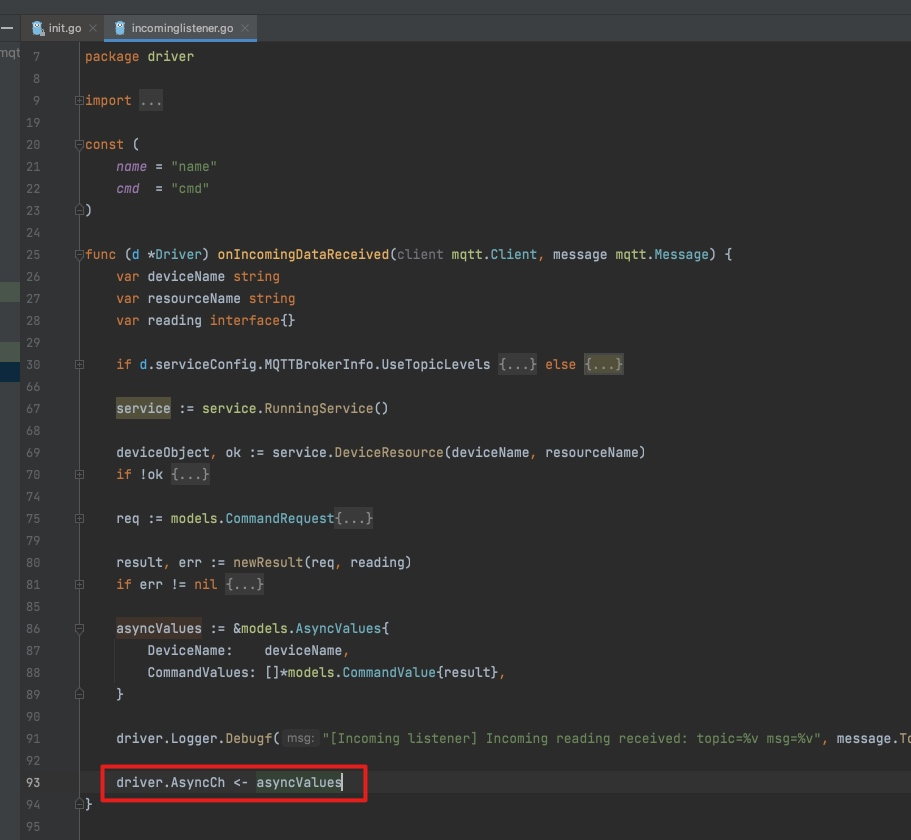

## 示例

假设现在我们需要写一个device-service，实现TCP设备的接入。

由于是非响应式的采集，因此以`device-mqtt-go`工程为蓝本进行修改，以大致需要以下几个步骤：

1. 定义配置信息

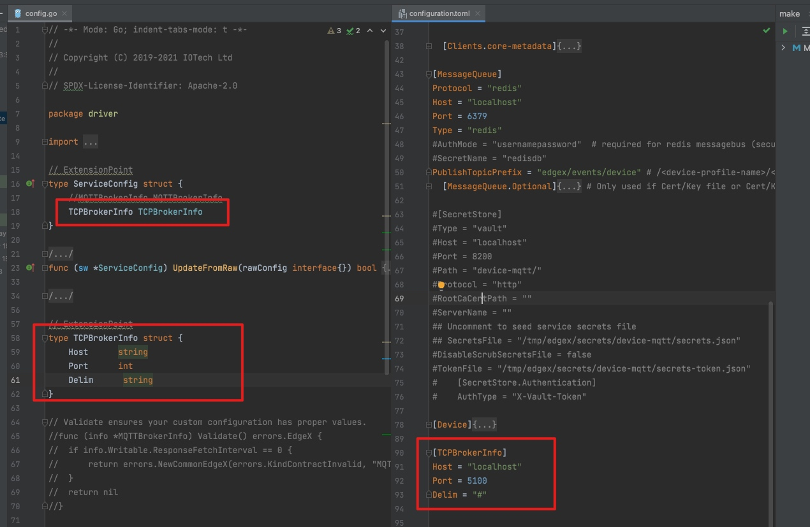

2. 改造driver.go中的Initialize方法，启动TCP server

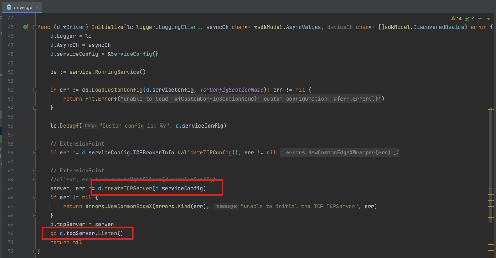

3. 在收到消息后的回调方法里，对消息进行解析和包装，并发送到driver.AsyncCh管道中。

包装的大致路径是：models.CommandRequest + 值 -> sdkModel.CommandValue  -> models.AsyncValues 。

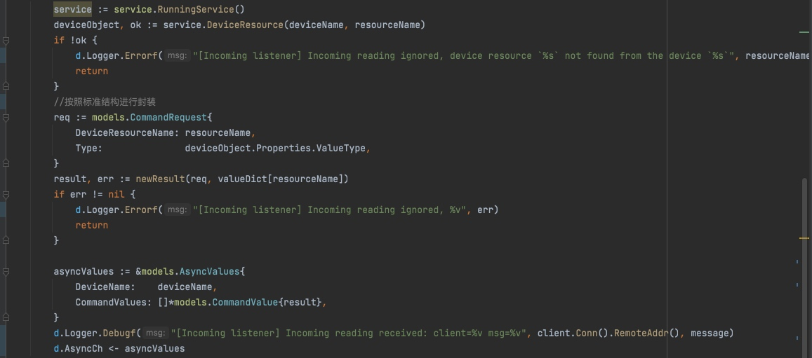

