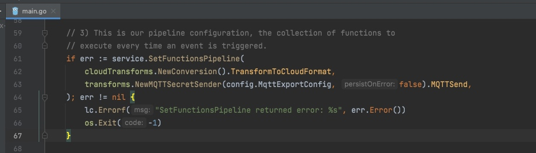
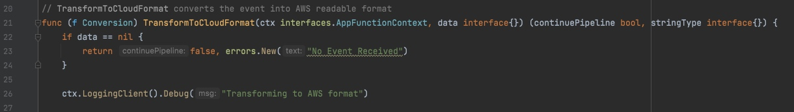
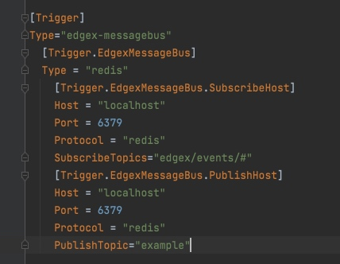

# 3 自定义应用服务（go）

edgex没有提供官方的application service，因为每个用户对数据的应用场景都是不同的。因此提供了一些demo工程，放在了edgex-examples内。

比较典型的是cloud-export-mqtt这个示例。它完成了对数据格式的转换，并通过MQTT协议发送到云端。

## 消息处理总线（edgex messagebus）

在application service启动时，可以通过`service.SetFunctionsPipeline`方法构建一个消息总线，然后在总线内，放入消息处理的方法就行了。有些像Apache Camel的那种规则路由。

因此基于edgex SDK开发自己的应用服务就变得非常简单了，只要在处理总线中添加并实现自己的处理方法就行了，edgex会在收到消息后按顺序回调加入的方法。

可以看出，`service.SetFunctionsPipeline`的参数中接受的回调方法的参数和返回结果是固定的，即参数是上下文信息和数据，返回结果是是否继续传递和处理后的数据。
其中，是否继续传递可以控制数据进入不同的处理分支（二元分支）。

## 消息源

我们并不需要关心消息是怎么进入到消息总线的，只要调用`service.SetFunctionsPipeline`方法就行了。

但得了解edgex的消息是从哪来的，因为有时我们需要指定redis的地址，或者对数据进行过滤。

edgex是从配置文件的[Trigger]部分来获得数据源配置的。

上面指定了，redis pipeline的IP、端口和topic，值得关注的是 `SubscribeTopics`这项，通过这个配置项我们可以对数据进行过滤，即这个application service只接收和处理某个profile的数据，或者某个设备的数据，或者某个属性的数据。这个可以通过topic的层级进行实现，规则如下：`edgex/events/device/<device-profile-name>/<device-name>/<source-name>`，可以在结尾使用#这种通配符。

这样便能实现，不同的设备数据，由不同的application service来处理。