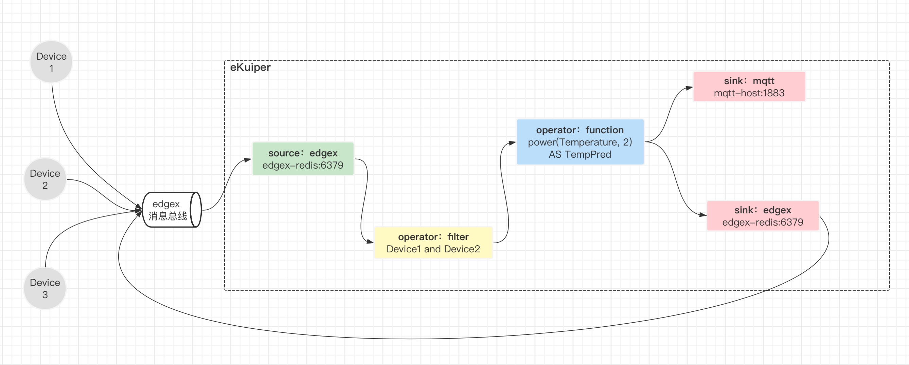
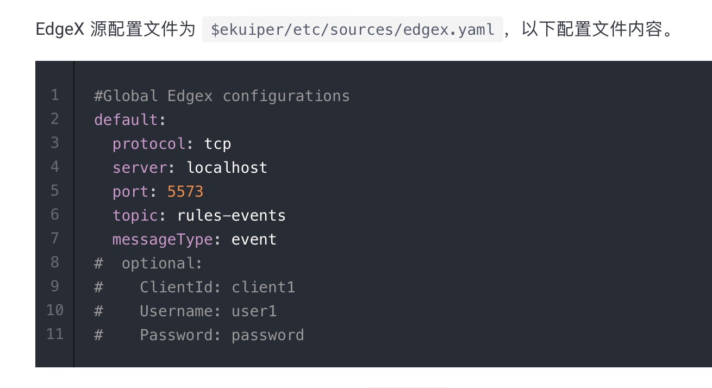
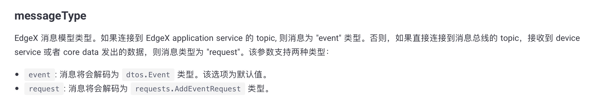
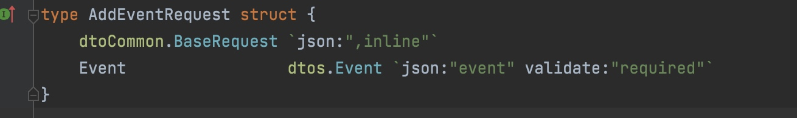
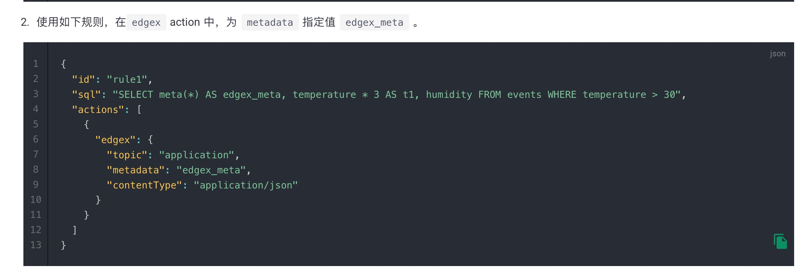
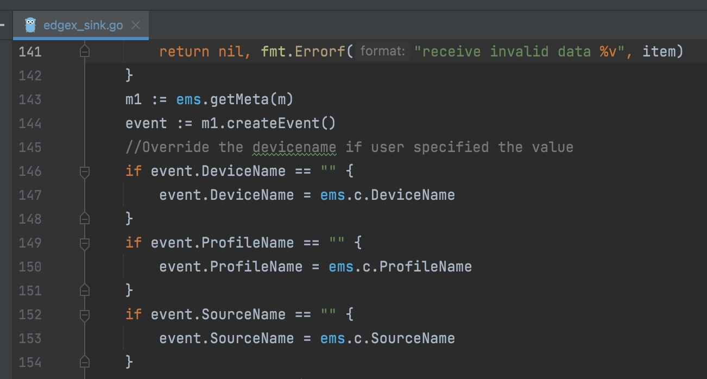

# 5 与规则引擎eKuiper联动（图拓扑规则）


LF Edge eKuiper 是 Golang 实现的轻量级物联网边缘分析、流式处理开源软件，可以运行在各类资源受限的边缘设备上。eKuiper是一个规则引擎，即按一定的规则去处理数据。eKuiper灵活地解决了：从哪里取数，进行什么处理，处理完发到哪去 这些问题。

eKuiper虽然不是edgex的一部分，但与edgex做了比较深的集成。

关于eKuiper的基本使用，可以参考官方文档：https://ekuiper.org/docs/zh/latest/ 进行实现。

本文仅专注于**如何在edgex中使用eKuiper的图拓扑规则来进行一些数据的处理**。同时指出eKuiper哪些能做到，哪些做不到，有哪些坑。

注：基于eKuiper版本1.6.2。


## 场景

在物联网的场景下，一些设备的数据是需要进行加工或处理的，比如：
1. 做一些简单计算
   典型的是温度采集上来都是int型的，需要除以10或100再-40得到真实值。这种线型标定，可以在采集时进行。比如edgex中的device-modbu采集服务就可以通过配置来实现。
   但如果采集阶段不由我们控制，我们不好干涉，需要上报后处理，那一种办法是在自定义的application service中写逻辑处理，也可以使用eKuiper进行处理。
   
2. 进行采样或聚合
   想计算下每分钟的平均温度，然后再发送到云端或者发送到application service中去处理或者触发对设备的控制。这种场景非常适合使用eKuiper进行。
   
   
因此，我希望通过edgex和eKuiper的图规则来实现以下场景：
1. eKuiper从edgex接收设备数据
2. 对数据进行计算
3. 把计算结果作为一个新的属性 发回到edgex中
4. 同时，把计算结果发到mqtt server上。

如图所示：



   
## 配置
   
### 准备工作

1. 启动edgex的核心模块
2. 启动eKuiper，最好启动eKuiper UI
3. 启动一个mqtt server
4. 定义设备profile和设备
5. 通过device-service向消息总线发送数据

然后，开始配置图拓扑规则。图拓扑规则的API的body数据格式如下：

```json
{
  "id": "graph_rule_demo",   //规则id，唯一标识
  "name": "Graph Rule - control",  //规则名称
  "graph": {
    "nodes": {                   //节点列表，定义图上的节点
      "local-edgex-source": {
        "type": "source",
        "nodeType": "edgex",
        "props": {
          "confKey": "citic_conf"
        }
      },
      ……
    },
    "topo": {                   //关系列表，定义图中的连线
      "sources": ["local-edgex-source"],
      "edges": {
        "local-edgex-source": ["device-filter"],
        ……
      }
    }
  }
}
```

### 源配置

关于图拓扑配置的官方文档都很少。

拓扑中nodes的json结构如下：

```json
  "your-source-name": {
    "type": "source",
    "nodeType": "edgex",
    "props": {
      ……
    }
  }
```

然后你看官方文档提到的配置：



看似你能在props下面去自己定义这些参数。**但实际上，这些属性都不能生效**。也就是说：
1. 如果不指定confKey，那就会用default的配置，定义的这些参数也不能覆盖default中的定义
2. 如果指定了confKey，那定义的这些参数也不能覆盖confKey中的定义
因此，想在props中动态的指定topic，来实现过滤设备或属性的办法是不行的。

总结一下，目前从edgex的消息总线中接收数据，有2种方式：

1. 用default配置，配置内容如下：
```json
name: default
messageType: event
port: 6379
protocol: redis
server: edgex-redis
topic: rules-events
type: redis
```

这种情况下，node配置中props缺省就行了。
```json
  "your-source-name": {
    "type": "source",
    "nodeType": "edgex",
    "props": {
    }
  }
```

但其实展示的是错的，实际订阅的topic是`edgex/events/device/#`，这在ekuiper控制台日志里可以看到。

2. 如果redis地址不是这个，要先配一个自定义的配置，配置内容如下：

```
name: my_conf
messageType: request    //如果从消息总线，这里必须是request
port: 6379
protocol: redis
server: edgex-redis       //实际redis的ip或域名
topic: edgex/events/device/#     //这个topic可以按需进行，但要按照edgex的层级
type: redis
```


**注意：**
如果从消息总线中接收消息，那messageType要使用request。 topic前缀为`edgex/events/device`，并遵循edgex的层级结构：`edgex/events/device/<device-profile-name>/<device-name>/<source-name>`。



但其实dtos.Event 和 requests.AddEventRequest 的区别不大，从源码看，AddEventRequest在Event外面包了一层：




此时，props中的confKey配为已有配置即可。

```json
"your-source-name": {
    "type": "source",
    "nodeType": "edgex",
    "props": {
      "confKey": "my_conf"
    }
},
```


### 规则配置

图拓扑中的规则配置，请参考官方文档：https://ekuiper.org/docs/zh/latest/rules/graph_rule.html

但文档中都是些简单的示例。所以我们要把之前的SQL转换成json的配置项，只能不断尝试。下面是一部分规则的注意点。

#### 条件过滤

```json
"device-filter": {
    "type": "operator",
    "nodeType": "filter",
    "props": {
      "expr": "meta(deviceName) = \"DemoModbusDevice\" AND Temperature < 30"
    }
  },
```

**注意：**
* 从event中取元数据，使用meta函数
* 逻辑拼接，使用AND / OR，而不是 && || 


#### 计算

```json
  "temp-cal": {
    "type": "operator",
    "nodeType": "function",
    "props": {
        "expr": "power(Temperature, 2) AS TemperaturePredict"
    }
  }, 
```

**注意：**
* 只能使用内置函数（文档：https://ekuiper.org/docs/zh/latest/sqls/built-in_functions.html ），所以到目前还不知道怎么计算 Temperature * 2 这种公式。
* 每个node只能算1个参数，比如像SQL这种 `power(Temperature, 2) AS TemperaturePredict, ln(Temperature, 2) AS TemperaturePredict2`形式是不行的，只有第1个会被计算，后面的参数会被忽略。


#### 字段过滤

在计算节点之后，会增加新属性，但原有属性也会保留。也就是说，如果此时再流回消息总线，那流回的这个消息也会重新进入到ekuiper源中，也就是成了循环，消息会指数级增长，很快把服务器资源用满。

为了避免成环，1种方法是在订阅的topic中加过滤，即在edgex源配置中，topic上配到详细的层级。这种的情况缺点是你只能处理某个设备或某类属性的数据。
还有1种方法是，我只向edgex总线发新生成的属性，这就用到了pick类型的node。

配置很简单：

```json
"field-pick": {
    "type": "operator",
    "nodeType": "pick",
    "props": {
        "fields": ["TemperaturePredict"]
    }
},
```

### sink配置


#### edgex动作

把消息流入edgex总线，最基础的配置如下：

```json
"local-edgex-sink": {
    "type": "sink",
    "nodeType": "edgex",
    "props": {
        "host":"edgex-redis",
        "port": 6379,
        "protocol": "redis",
        "messageType": "request",
        "topicPrefix": "edgex/events/device",
        "contentType": "application/json"
        }
    }
},
```


此时会发现，由于没有带过来元数据信息，流入edgex消息总线的数据里，deviceName、profileName和sourceName都使用了如下所示的默认值：

```json
{
    "apiVersion":"v2",
    "id":"37720fa9-ef58-427e-b636-0f2a4a6bf3f3",
    "deviceName":"ekuiper",
    "profileName":"ekuiperProfile",
    "sourceName":"graph_rule_edgex_demo",
    "origin":1666248283338039300,
    "readings":[
        {
            "id":"2988a557-1384-4244-9570-f8fe409cbbc9",
            "origin":1666248283338074000,
            "deviceName":"ekuiper",
            "resourceName":"TemperaturePredict",
            "profileName":"ekuiperProfile",
            "valueType":"Float64",
            "value":"2.433600e+02"
        }
    ]
}
```

如果只处理一个设备的数据，那在props中直接配置topic就可以了，如`topic: edgex/events/device/ProfileAAA/DeviceAAA/TemperaturePredict`。或者配置topicPrefix，并配置deviceName、profileName和sourceName，如：

```
"topicPrefix": "edgex/events/device",
"deviceName":"DeviceAAA",
"resourceName":"TemperaturePredict",
"profileName":"ProfileAAA",
```

#### meta填充

如果我处理的是多个设备，那deviceName就不能配死了，这就需要配置动态元数据，来保留之前的元数据。

按照文档 [动态元数据](https://ekuiper.org/docs/zh/latest/rules/sinks/builtin/edgex.html#%E5%8A%A8%E6%80%81%E5%85%83%E6%95%B0%E6%8D%AE) 中所示：

 

把这个转换到图拓扑的配置就是，先要加一个计算node，产生edgex_meta这个字段，然后在edgex sink中配置metadata，如下所示：

```json
  "meta-fill": {
    "type": "operator",
    "nodeType": "function",
    "props": {
      "expr": "meta(*) AS edgex_meta"
    }
  },
```

```json
  "local-edgex-sink": {
    "type": "sink",
    "nodeType": "edgex",
    "props": {
        "host":"edgex-redis",
        "port": 6379,
        "protocol": "redis",
        "messageType": "request",
        "topicPrefix": "edgex/events/device",
        "contentType": "application/json"
        "metadata": "edgex_meta"
    }
  }
```


**注意：**
* 填充meta的字段只能叫edgex_meta这个名字，叫别的名字会被当做属性处理。
* edgex sink中一旦配置了metadata，deviceName、profileName和sourceName的配置都不生效。（从下面源码可以看出）





这就有问题了，我的场景下其实只是想保留deviceName、profileName，而sourceName指定为新生成的字段`TemperaturePredict`，也就是说仅仅deviceName、profileName是动态的，但这在目前没办法做到。

个人感觉应该是props中deviceName、profileName和sourceName的配置优先级更高，用户的主观配置去覆盖meta中的数据才合理。


### 总体配置

整个规则的配置如下，仅供参考：

```json
{
  "id": "graph_rule_edgex_demo",
  "name": "Test Graph Rule",
  "graph": {
    "nodes": {
      "local-edgex-source": {
        "type": "source",
        "nodeType": "edgex",
        "props": {
          "confKey": "my_conf"
        }
      },
    "device-filter": {
        "type": "operator",
        "nodeType": "filter",
        "props": {
          "expr": "meta(deviceName) = \"DemoModbusDevice\" AND Temperature < 30"
        }
      },
      "temp-cal": {
        "type": "operator",
        "nodeType": "function",
        "props": {
          "expr": "power(Temperature, 2) AS TemperaturePredict"
        }
      },      
      "field-pick": {
        "type": "operator",
        "nodeType": "pick",
        "props": {
        "fields": ["TemperaturePredict"]
        }
      },
     "meta-fill": {
        "type": "operator",
        "nodeType": "function",
        "props": {
          "expr": "meta(*) AS edgex_meta"
        }
      },
      "local-mqtt-sink": {
        "type": "sink",
        "nodeType": "mqtt",
        "props": {
          "server": "tcp://local-emqx:1883",
          "topic": "demo/sink/greater"
        }
      },
      "local-edgex-sink": {
        "type": "sink",
        "nodeType": "edgex",
        "props": {
            "host":"edgex-redis",
            "port": 6379,
            "protocol": "redis",
            "messageType": "request",
            "topicPrefix": "edgex/events/device",
            "contentType": "application/json"
        }
      }
    },
    "topo": {
      "sources": ["local-edgex-source"],
      "edges": {
        "local-edgex-source": ["device-filter"],
        "device-filter": ["temp-cal"],
        "temp-cal": ["field-pick"],
        "field-pick": ["meta-fill"],
        "meta-fill": ["local-mqtt-sink", "local-edgex-sink"]
      }
    }
  }
}
```

上面的配置并不能直接完成最初的场景设定，即：通过计算生成新的属性，并流回edgex的消息总线（虽然流回了消息总线，但里面的数据格式不是理想的）。
work around方法是，我把edgex_meta作为一个属性，放回消息总线，在application service中二次处理。

最终，流入消息总线的消息如下：

topic： `edgex/events/device/ekuiperProfile/ekuiper/graph_rule_edgex_demo`

```json
{
    "apiVersion":"v2",
    "id":"7274c14e-ba66-4c55-9ef3-45856f9d75c0",
    "deviceName":"ekuiper",
    "profileName":"ekuiperProfile",
    "sourceName":"graph_rule_edgex_demo",
    "origin":1666250712010773200,
    "readings":[
        {
            "id":"3138b5eb-8b5a-40d3-bca2-b3352ef6ca98",
            "origin":1666250712010787000,
            "deviceName":"ekuiper",
            "resourceName":"edgex_meta",
            "profileName":"ekuiperProfile",
            "valueType":"Object",
            "objectValue":{
                "Temperature":{
                    "deviceName":"DemoModbusDevice",
                    "id":"b9652a7f-3ff2-4cb4-8789-2c8db1f263b8",
                    "origin":1666250712009348900,
                    "profileName":"DemoModbusProfile",
                    "valueType":"Float32"
                },
                "correlationid":"29e2f9f5-38d6-42a8-bfdf-56811619a8d6",
                "deviceName":"DemoModbusDevice",
                "id":"dacaeb8f-7568-44d2-af7f-e4ce6ecd375c",
                "origin":1666250712009531400,
                "profileName":"DemoModbusProfile",
                "sourceName":"Temperature",
                "tags":null
            }
        },
        {
            "id":"98d45a05-c613-441b-ad20-957327e80bf4",
            "origin":1666250712010809000,
            "deviceName":"ekuiper",
            "resourceName":"TemperaturePredict",
            "profileName":"ekuiperProfile",
            "valueType":"Float64",
            "value":"2.433600e+02"
        }
    ]
}
```

发到mqtt的消息如下：

```json
[
    {
        "TemperaturePredict":243.36001190185561,
        "edgex_meta":{
            "Temperature":{
                "deviceName":"DemoModbusDevice",
                "id":"ac8764e1-dcfd-4210-b410-8e56e00bc722",
                "origin":1666252953917595800,
                "profileName":"DemoModbusProfile",
                "valueType":"Float32"
            },
            "correlationid":"af8b46ac-a9da-4475-8db5-b9644f09db15",
            "deviceName":"DemoModbusDevice",
            "id":"8baf53af-4633-4ffd-aa48-64b0ae55be0d",
            "origin":1666252953917725800,
            "profileName":"DemoModbusProfile",
            "sourceName":"Temperature",
            "tags":null
        }
    }
]
```

可以看到，edgex_meta被当做一个属性进行了包装，进入了edgex消息总线。